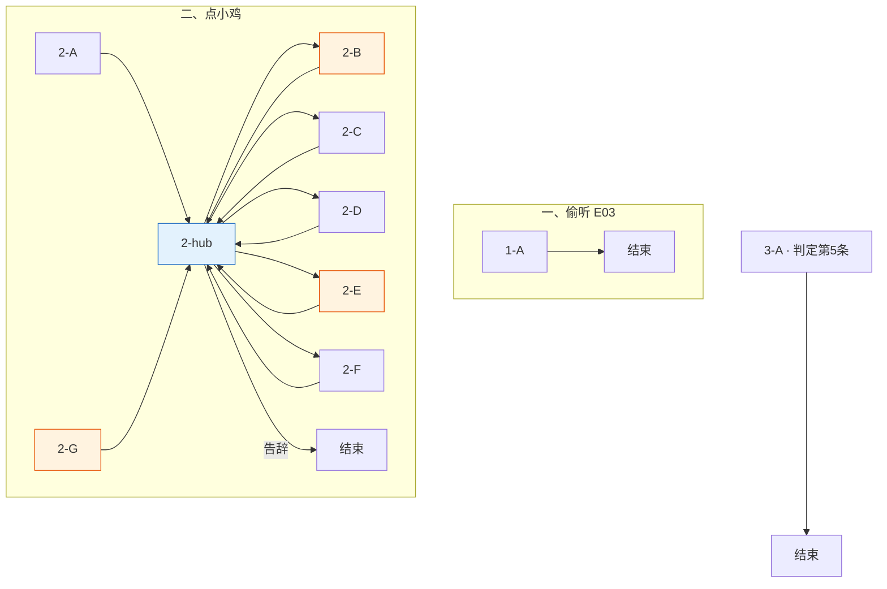

# 小鸡侦探团 · 对话脚本（树状）

> **状态**：小鸡侦探团对话**实施准稿**（以本树状脚本为准）。  
> **变量**：见 [17-全局游戏状态变量](../17-全局游戏状态变量.md)；本脚本只引用该表，不另造变量。  
> **描述行**：text 树块内一律 `描述：（……）`，见 [18 §18.2](../18-树状对话脚本生成方法.md)。  
> **说话方**：**阿满** / **米粒** / **豆豆** / **瓜子**，全程使用此四名。  
> **方法**：[18](../18-树状对话脚本生成方法.md) · [16](../16-NPC对话脚本书写守则.md)。  
> **润色**（2026-07-20）：按通用四层标准通篇重审；**待审**，通过后再回写 lua。

---

## 流程总览

**一、鸡舍周边 · 偷听（E03）**

1. **1-A** 身后偷听 → `E03_Overheard` → **对话结束**

**二、主交互（点小鸡侦探团）**

> 点小鸡时**入口判定**（按序匹配第一条）见各节点〔系统注〕。

1. **2-A** 首访 → `ChickStatus=1` → **2-hub【回访】+【菜单】**
2. **2-hub** 点小鸡首进播 Status【回访】+【菜单】；子项 **2-B**～**2-F** / **2-G** 播完回 hub 短【回访】+【菜单】（`Chick_HubFromSubItem` 区分）；告辞结束
3. **2-B** 水怪说质询 → `ChickStatus=2` → **2-hub【回访】+【菜单】**
4. **2-E** E10 质询招供 → `ChickStatus=3` → **2-hub【回访】+【菜单】**
5. **2-G** 黑猫案情补漏全招（仅 `BlackCat_CaseLineStarted && ChickStatus<=1`）→ `ChickStatus=3` → **2-hub**；普通进程不出现

**三、第二章 · 愧疚待命（点小鸡）**

- **3-A**【轮播】一次性（`DogStatus==4 && ChickStatus==3 && !Chick_Chapter2GuiltShown`）→ 结束

**二周目**：`NGPlus && !Chick_NGPlusShown` → NGPlus 一次性 → 结束；再点 → NGPlus【轮播】

> 小鸡**无路过 trigger**；除 **E03** 环境点（**点击交互**，非强制播）外，全线为**点小鸡**播对话。

变量写入见各节点【变量】；全局对照 [17 §17.10](../17-全局游戏状态变量.md#1710-小鸡侦探团树状脚本速查)。

### 分章流程图




**图例**：橙色 = 关键质询 / 补漏招供；蓝色 = hub（首进 Status【回访】+【菜单】；子项返回短【回访】+【菜单】）。

**对话结束**：偷听（E03 环境）、告辞、**3-A** 一次性、NGPlus 一次性后结束；子项返回 **2-hub**【回访】+【菜单】。

---

## 一、鸡舍周边 · 偷听点

> 〔系统注〕**E03** 环境点（非点小鸡）。玩家进入小鸡圈子**背后**范围后**点击交互键**播 **1-A**（非强制播）。`!E03_Overheard` 只播一次。偷听段玩家无台词。  
> **交互关闭**：`E03_Overheard` 后或 `ChickStatus>=3`（**2-E** / **2-G** 招供）后，`E03EavesdropController` 调用 `DisableInteraction` 关闭本点。

---

### 1-A · 身后偷听（E03）

> 〔系统注〕播毕写 `E03_Overheard`（`ChickTraceCount` 由环境侧 +1）。

```text
1-A
│
└─ 豆豆·背对：（压声）昨晚外面那声音……肯定是水怪干的……
   米粒·背对：（压声）池塘那边青蛙还说，宝珠沉下去了……
   瓜子·背对：（极小声）……可是大前天……明明是我们自己……
   阿满·背对：（压声）瓜子！别说了！
   豆豆·背对：（压声）那要是有人来问，咱们怎么说？
   阿满·背对：（压声）就说……水怪。从池塘来的。把蛋叼走了……
   阿满·背对：（压声）只能是这样……不然弟弟怎么会不见……

→ 对话结束

【变量】
· E03_Overheard = true
```

---

## 二、主交互阶段

> 〔系统注〕点小鸡侦探团时，**按序匹配**：
>
> 1. `NGPlus && !Chick_NGPlusShown` → **NGPlus**（见 §二周目）
> 2. `NGPlus && Chick_NGPlusShown` → NGPlus【轮播】
> 3. **`BlackCat_CaseLineStarted && ChickStatus<=1` → 2-G**（黑猫案情补漏全招；不经 hub；普通进程不出现）
> 4. `ChickStatus==0` → **2-A** → **2-hub**
> 5. `DogStatus==4 && ChickStatus==3 && !Chick_Chapter2GuiltShown` → **3-A** → **对话结束**
> 6. `ChickStatus>=1` → **2-hub**

---

### 2-A · 首次接触

> 〔系统注〕玩家主动搭话；小鸡被动、发虚。播毕 `ChickStatus=1` → **2-hub【回访】+【菜单】**。`BlackCat_CaseLineStarted` 时由入口走 **2-G**，不进本节点。

```text
2-A
│
└─ 玩家：嘿，你们在干什么？
   描述：（四只小鸡挤在鸡舍边，各自戴着歪歪扭扭的纸板墨镜装酷）
   米粒·装酷：（小声）有人来了……
   豆豆·装酷：别、别看他……
   描述：（阿满往前挪了半步，又停住）
   阿满·装酷：……
   玩家：淑芬的蛋不见了，你们知道吗？
   描述：（阿满墨镜滑到喙尖）
   瓜子·装酷：（极小声）弟弟……
   阿满·心虚：（急）瓜子！别乱叫！
   描述：（阿满把墨镜顶回去）
   阿满·装酷：我们……暗影侦探团……也在查这案子。
   阿满·装酷：事情不小。你最好别乱插手。
   玩家：能告诉我点什么吗？
   描述：（豆豆拽了拽阿满翅膀）
   阿满·装酷：……
   阿满·装酷：内部情报。不能对外说。
   玩家：总得说点什么吧。
   描述：（米粒和豆豆对视一眼）
   米粒·装酷：……我们忙着呢。真的。
   豆豆·装酷：对。外勤任务排满了。
   描述：（瓜子低着头，喙动了动，没出声）

→ 2-hub【回访】+【菜单】

【变量】
· ChickStatus = 1
```

---

### 2-G · 黑猫案情补漏全招

> 〔系统注〕**仅补漏**：`BlackCat_CaseLineStarted && ChickStatus<=1`（入口强制；不经 hub）。普通先小鸡进程 `CaseLineStarted=false`，永不可达。  
> 一场对话合并水怪误会 + 石头假蛋招供（事实链对齐 **2-E**，略压缩）；必须钉牢三件事：大前天制假并踢球、假石入草丛后被乌鸦叼走、昨晚真蛋失踪。末写 `ChickStatus=3`（笔记本 D03+D09；D03 划掉随 D09）。收束指引池塘问蛙，措辞与 **2-B** 区分。前提：案情已开 ⇒ `E10_ViewWhiteStone` 已为 true。

```text
2-G
│
└─ 玩家：黑猫让我来问——你们这两天到底发生了什么？
   玩家：我在乌鸦那儿看见一块白石头。跟你们有关吧。
   描述：（四只小鸡僵住）
   阿满·心虚：……
   瓜子·心虚：（哭腔）我们……我们把弟弟弄丢了……
   阿满·愧疚：大前天下午，我们捡了块白石头，画成蛋的样子，放进窝里假装是蛋，
   阿满·愧疚：然后把真的弟弟偷出来——踢球。
   阿满·愧疚：推着弟弟路过谷仓时，老鼠叔叔蹿出来说——
   阿满·愧疚：有沼泽水怪，专门吃沾泥的蛋！
   豆豆·心虚：（气鼓鼓）现在想起来他们全程在憋笑！！
   玩家：然后呢？
   阿满·愧疚：我们吓得跑去池塘洗蛋，又被青蛙的话吓着了——
   阿满·愧疚：赶紧把真蛋推回窝里！
   米粒·愧疚：假石头嘛……大前天随手扔进草丛了……
   瓜子·心虚：（小声）后来……被乌鸦叼走了。
   阿满·愧疚：弟弟当时已经推回窝了。真要不见，是昨晚！
   玩家：昨晚有动静吗？
   豆豆·愧疚：睡前弟弟还在……半夜一看，窝空了……
   米粒·心虚：外面有好响的声音……我们以为是水怪……
   阿满·愧疚：（哭）如果没有水怪……到底是谁带走了弟弟？
   豆豆·心虚：昨晚那声响……池塘那边的青蛙说不定听见了！
   米粒·心虚：去问问他……求你……

→ 2-hub【回访】+【菜单】

【变量】
· ChickStatus = 3
```

---

### 2-hub · 主菜单 hub

> 〔系统注〕**入口判定**进 hub 播 Status【回访】；**子项 2-B～2-F / 2-G** 返 hub 播短【回访】——用 `Chick_HubFromSubItem` 区分（子项末写 `true`，return hub 播毕清 `false`）。  
> **2-B / 2-E** 另加 `!BlackCat_CaseLineStarted`（补漏窗双保险；案情未开时与旧条件等价）。

```text
2-hub
│
├─ 【回访】（入口判定 / **2-A** 同链 · ChickStatus==1）
│  阿满·装酷：……还在查。别碰我们的现场。
│
├─ 【回访】（入口判定 · ChickStatus==2）
│  阿满·装酷：池塘那边……你去了吗？
│
├─ 【回访】（入口判定 · ChickStatus==3）
│  阿满·装酷：……外勤先停了。有事就快说。
│
├─ 【回访】（子项 **2-B**～**2-F** / **2-G** 返 hub · Chick_HubFromSubItem）
│  描述：（四只小鸡又挤到一起）
│  阿满·装酷：……还有什么事吗？
│
└─ 【菜单】
   「你们到底在搞什么鬼？」（ChickTraceCount>=2 && ChickStatus==1 && !BlackCat_CaseLineStarted）→ 2-B
   「谷仓角落有个草窝，知道谁的吗？」（E07_ViewNapSpot && !Chick_NapSpotAsked）→ 2-C
   「大黄宿醉那样，怎么叫醒？」（DogStatus==2 && !Chick_WakeDogHintShown）→ 2-D
   「这玩意儿，你们怎么解释？」（E10_ViewWhiteStone && ChickStatus<3 && !BlackCat_CaseLineStarted）→ 2-E
   「我准备上谷仓顶找乌鸦。」（(DogStatus>=2 || E06_LadderBorrowed) && !E10_ViewWhiteStone && !Chick_RoofBlockShown）→ 2-F
   「没事，走了。」→ 对话结束
```

---

### 2-B · 水怪说质询

> 〔系统注〕`ChickTraceCount>=2 && ChickStatus==1 && !BlackCat_CaseLineStarted`（招供 **2-E** / **2-G** 后 `ChickStatus=3` 不再出现）。情绪：防线崩掉，把心里真怕的水怪说出来。本节点保留完整「去池塘问蛙」收束；**2-E** / **2-G** 不得原样复用。

```text
2-B
│
└─ 玩家：你们到底在搞什么鬼？
   玩家：鸡舍边上那些乱七八糟的痕迹——和你们有关吧。
   描述：（阿满脖子一缩）
   阿满·心虚：……那是……
   米粒·心虚：侦、侦探工具……
   描述：（四只小鸡挤得更紧）
   玩家：说！有什么事瞒着我！
   瓜子·心虚：（哭腔）水怪……水怪把弟弟叼走了……
   阿满·心虚：对！！就是水怪！！
   描述：（阿满朝池塘方向猛点头）
   阿满·心虚：三个脑袋！浑身绿色！
   阿满·心虚：从池塘爬上来！把蛋拖进水里了！！
   玩家：你亲眼看见的？
   阿满·心虚：没、没看见……但肯定是！！
   阿满·心虚：昨晚外面那声音……青蛙也说过……
   阿满·心虚：（发颤）不然弟弟怎么会不见……
   豆豆·心虚：池塘那只青蛙肯定见过！！
   米粒·心虚：快去问他！！求你快去！！
   描述：（阿满墨镜歪了，顾不上扶）

→ 2-hub【回访】+【菜单】

【变量】
· ChickStatus = 2
```

---

### 2-C · 谷仓午睡点（可选）

> 〔系统注〕`E07_ViewNapSpot`；一次性。不指认黑猫；装酷团嘴硬回避。

```text
2-C
│
└─ 玩家：谷仓角落有个草窝，你们知道是谁的吗？
   描述：（阿满皱眉）
   阿满·装酷：谷仓角落？不在我们巡逻范围。
   米粒·装酷：（小声）我……我没注意那边。
   玩家：压痕挺新的。
   豆豆·装酷：问错地方了！我们只守鸡舍这边！
   阿满·装酷：……没什么好说的。

→ 2-hub【回访】+【菜单】

【变量】
· Chick_NapSpotAsked = true
```

---

### 2-D · 叫醒大黄（可选）

> 〔系统注〕`DogStatus==2`（大黄半睡）。**【谷物泡水】**位置提示；笔记本 D08 在本节点播毕写入（如尚未持有），E05 交互只在 D08 旁标注 **✓ get**。

```text
2-D
│
└─ 玩家：大黄宿醉成那样，有什么法子叫醒他吗？
   描述：（豆豆蹦了一下，墨镜歪了）
   豆豆·装酷：大黄叔叔？他还在那儿躺着？！
   描述：（阿满按住豆豆）
   阿满·装酷：……嗯。
   玩家：有办法吗？
   描述：（阿满压低声音，翅膀尖抖了一下）
   阿满·装酷：鸡舍水槽边，有老谷物泡的水。
   阿满·装酷：他爱喝。灌下去就醒。
   阿满·装酷：……拿去。算侦探团对前辈的关照。
   瓜子·装酷：（小声）……这次能帮上忙吗？

→ 2-hub【回访】+【菜单】

【变量】
· Chick_WakeDogHintShown = true
```

---

### 2-F · 差点漏嘴（可选）

> 〔系统注〕一次性。玩家仍可上顶；瓜子差点漏嘴被阿满捂住。菜单锁：`DogStatus>=2`（大黄 **1-A** 后已入簿 D07）或 `E06_LadderBorrowed`，且 `!E10_ViewWhiteStone`。  
> **线索权限**：此时玩家仅持 D07「乌鸦把蛋叼到谷仓屋顶了？」或梯子条件，**不得**提前说出草丛、白蛋、今早等未拥有信息。

```text
2-F
│
└─ 玩家：我准备上谷仓顶找乌鸦。
   豆豆·心虚：啊？谷仓顶上有什么？
   玩家：大黄说——乌鸦把蛋叼上屋顶了。
   描述：（四只小鸡僵住）
   阿满·心虚：……屋顶？
   米粒·心虚：（小声）蛋……？
   玩家：乌鸦还守在上面。我得上去看看。
   描述：（阿满跟另外三只对视一眼；豆豆嘴张了张，没出声）
   瓜子·心虚：（极小声）会不会是……
   阿满·心虚：（急）瓜子！
   玩家：什么？
   描述：（四只小鸡一起闭嘴了）

→ 2-hub【回访】+【菜单】

【变量】
· Chick_RoofBlockShown = true
```

---

### 2-E · E10 质询招供

> 〔系统注〕信念崩塌后的崩溃招供。菜单另加 `!BlackCat_CaseLineStarted`（补漏走 **2-G**）。跳过 **2-B** 时悲伤蛙 **2-D** 改读 `ChickStatus==3`（见悲伤蛙 **2-hub**）；`09` D03 亦可由 **2-G** 写入 `ChickStatus=3` 时入册。  
> **三件事必须分清**：大前天制假+踢球+洗蛋归窝；假石入草丛后被乌鸦叼走；昨晚真蛋失踪。大黄 D07 只作「叼蛋上屋顶」的误导线索，由小鸡澄清时间，玩家不得编造大黄没说过的具体钟点。收束落在愧疚，不重复 **2-B** 的完整推蛙。

```text
2-E
│
└─ 玩家：你们猜，我千辛万苦爬上去，在乌鸦那儿找到什么了？
   描述：（四只小鸡对视，谁也不说话）
   米粒·愧疚：……蛋？
   玩家：说！这是什么！怎么回事！
   描述：（四只小鸡凑过来，又猛地僵住）
   瓜子·愧疚：……是我们画的。
   描述：（墨镜啪嗒落地）
   阿满·愧疚：那不是老妈的蛋……乌鸦叼走的是假的……
   阿满·愧疚：（哭）那弟弟呢——弟弟到底在哪——
   描述：（阿满翅膀捂住脸）
   阿满·愧疚：呜呜呜——我招了！！
   玩家：从头说。
   阿满·愧疚：大前天下午，我们捡了块白石头，画成蛋的样子，放进窝里假装是蛋，
   阿满·愧疚：然后把真的弟弟偷出来——
   米粒·心虚：（小声）踢球。
   玩家：踢……球？你们拿弟弟当球踢？
   描述：（几只小鸡低头不语）
   玩家：然后呢？
   阿满·愧疚：推着弟弟路过谷仓时，老鼠叔叔蹿出来说——
   阿满·愧疚：有沼泽水怪，晚上爬出来，专门吃沾了泥土的蛋！
   豆豆·心虚：（气鼓鼓）现在想起来他们全程在憋笑！！
   阿满·愧疚：我们吓得跑去池塘洗蛋，又被青蛙的话吓着了——
   阿满·愧疚：赶紧把真蛋推回窝里！
   玩家：假石头呢？
   米粒·愧疚：假石头嘛……大前天随手扔进草丛了……
   瓜子·心虚：（小声）后来……被乌鸦叼走了。
   玩家：那大黄说乌鸦叼蛋上屋顶——？
   描述：（四只小鸡对视）
   米粒·心虚：大黄叔叔喝了两天酒，日子都搅糊涂了……
   阿满·愧疚：（哭）乌鸦叼走的是我们画的假石头——大前天的事！
   阿满·心虚：弟弟是昨晚才不见的！跟那一趟不是一回事！
   玩家：昨晚有动静吗？
   豆豆·愧疚：睡前弟弟还在……半夜一看，窝空了……
   米粒·心虚：外面有好响的声音……我们以为是水怪……
   阿满·愧疚：（哭）如果没有水怪……到底是谁带走了弟弟？
   描述：（阿满瘫坐）
   瓜子·愧疚：……以后再也不偷弟弟出去踢球了。
   描述：（鸡舍里很安静）

→ 2-hub【回访】+【菜单】

【变量】
· ChickStatus = 3
```

---

## 三、第二章 · 愧疚待命

> 〔系统注〕**点小鸡**；`DogStatus==4 && ChickStatus==3 && !Chick_Chapter2GuiltShown` 走入口判定第 **5** 条 进 **3-A**【轮播】，播毕结束。已招供、被淑芬教训过。无路过 trigger。

```text
3-A
│
└─ 【轮播】
   ├─ 豆豆·心虚：（极小声）大侦探……
   │  瓜子·心虚：（更小声）别看我……
   │  阿满·愧疚：（压声）站好。
   │  玩家：淑芬还在哭。
   │  阿满·愧疚：……我们知道。
   │  瓜子·愧疚：（哭腔）是我们害的……
   │
   ├─ 米粒·愧疚：大侦探。
   │  玩家：嗯？
   │  米粒·心虚：要是……要是弟弟真在红顶屋……
   │  米粒·愧疚：我们就去认错。
   │  阿满·心虚：（小声）……嗯。
   │  玩家：还不确定。
   │  描述：（阿满点了一下头）
   │
   └─ 玩家：后悔吗？
      描述：（四只小鸡都不吭声）
      瓜子·愧疚：……后悔。
      阿满·愧疚：（哑）暗影侦探团……搞砸了。
      豆豆·心虚：我……再也不乱喊水怪了。
      阿满·装酷：别再提了。

→ 对话结束

【变量】
· Chick_Chapter2GuiltShown = true
```

---

## 二周目

> 〔系统注〕`NGPlus`。**点小鸡** → **NGPlus** 一次性 → **对话结束**；再点 → NGPlus【轮播】。

```text
NGPlus
│
└─ 描述：（四只小鸡坐在鸡舍门口；阿满墨镜搁在脚边）
   阿满·愧疚：……你来了。
   玩家：告诉你们一个好消息——弟弟出壳了。
   描述：（四只小鸡抬起头）
   瓜子·愧疚：……真的出来了？
   玩家：出来了。自己在窝里叫呢。
   描述：（豆豆扭头，翅膀蹭眼睛）
   豆豆·愧疚：我没哭。
   阿满·愧疚：……那段日子，我们天天盼他没事。
   玩家：现在好了。
   阿满·愧疚：（低声）嗯……其实当时，怕得很。
   玩家：那老鼠骗你们编水怪的事——还打算算账吗？
   描述：（豆豆翅膀一举）
   豆豆·愧疚：要算！！非得找他们算！！
   阿满·装酷：（打断）……
   描述：（阿满重新戴上墨镜）
   阿满·装酷：暗影侦探团自有安排。
   豆豆·愧疚：（小声）他们编得也太过分了……
   阿满·愧疚：（压声）豆豆，听见了。
   描述：（豆豆用力点头；米粒、瓜子也跟着点）

→ 对话结束

【变量】
· Chick_NGPlusShown = true
```

```text
NGPlus 回访
│
└─ 【轮播】
   ├─ 描述：（四只小鸡排成一列，墨镜戴正了）
   │  阿满·愧疚：同行。
   │  玩家：还有任务？
   │  阿满·愧疚：散步。
   │  豆豆·愧疚：（压声）顺便看老鼠在不在。
   │  阿满·愧疚：（压声）豆豆！！
   │
   ├─ 玩家：新案子？
   │  阿满·愧疚：没有。弟弟刚出壳，别出去疯。
   │  瓜子·愧疚：嗯。
   │
   └─ 描述：（瓜子盯着鸡舍里）
      玩家：看什么？
      瓜子·愧疚：看弟弟。
      描述：（窝里传来细弱的叫声）
      瓜子·愧疚：（小声）他刚才往这边看了。

→ 对话结束
```

---

## 条件覆盖自检

### 入口判定

**E03 偷听**：`!E03_Overheard` → **1-A**

**点小鸡**：`NGPlus&&!Chick_NGPlusShown`→**NGPlus** · `NGPlus&&Chick_NGPlusShown`→NGPlus【轮播】 · **`BlackCat_CaseLineStarted&&ChickStatus<=1`→2-G** · `ChickStatus==0`→**2-A** · `DogStatus==4&&ChickStatus==3&&!Chick_Chapter2GuiltShown`→**3-A** · `ChickStatus>=1`→**2-hub**

> **hub 子树**：**2-B**～**2-F** / **2-G** 返链不写 `ChickStatus==0` 等入口 flag；菜单互斥（`ChickStatus==1` · `!Chick_RoofBlockShown` · `!BlackCat_CaseLineStarted` 等）仍写全。

### 节点 / 菜单 / 返链


| 节点            | 进入（读取）                                                                      | 菜单项 / 分支 | 下一跳（写入后）                                      |
| ------------- | --------------------------------------------------------------------------- | -------- | --------------------------------------------- |
| **1-A**       | E03 背后靠近                                                                    | —        | 结束 · `E03_Overheard`                          |
| **2-A**       | `ChickStatus==0`（案情未开）                                                      | —        | **2-hub【回访】+【菜单】** · `ChickStatus=1`          |
| **2-hub**     | 点小鸡或子项返回                                                                    | 质询/可选/告辞 | 首进 Status【回访】+【菜单】；子项返短【回访】+【菜单】；告辞→结束        |
| **2-G**       | 入口 · `BlackCat_CaseLineStarted && ChickStatus<=1`（**仅补漏**）                  | —        | **2-hub【回访】+【菜单】** · `ChickStatus=3`          |
| **2-B**       | hub · `ChickTraceCount>=2` · `ChickStatus==1` · `!BlackCat_CaseLineStarted` | —        | **2-hub【回访】+【菜单】** · `ChickStatus=2`          |
| **2-C**       | hub · `E07` · `!Chick_NapSpotAsked`                                         | —        | **2-hub【回访】+【菜单】** · `Chick_NapSpotAsked`     |
| **2-D**       | hub · `DogStatus==2`                                                        | —        | **2-hub【回访】+【菜单】** · `Chick_WakeDogHintShown` |
| **2-E**       | hub · `E10` · `ChickStatus<3` · `!BlackCat_CaseLineStarted`                 | —        | **2-hub【回访】+【菜单】** · `ChickStatus=3`          |
| **2-F**       | hub · 拦路条件                                                                  | —        | **2-hub【回访】+【菜单】** · `Chick_RoofBlockShown`   |
| **3-A**       | 点小鸡 · `DogStatus==4` · `ChickStatus==3` · `!Chick_Chapter2GuiltShown`       | 【轮播】     | 结束 · `Chick_Chapter2GuiltShown`               |
| **NGPlus**    | `NGPlus`                                                                    | —        | 结束 · `Chick_NGPlusShown`                      |
| **NGPlus 回访** | `NGPlus&&Chick_NGPlusShown`                                                 | 【轮播】     | 结束                                            |


**本脚本【变量】块（9 处）**：`1-A` `E03_Overheard` · `2-A`/`2-B`/`2-E`/`2-G` `ChickStatus` · `2-C` `Chick_NapSpotAsked` · `2-D` `Chick_WakeDogHintShown` · `2-F` `Chick_RoofBlockShown` · `3-A` `Chick_Chapter2GuiltShown` · NGPlus `Chick_NGPlusShown`

---

## 路由规则（程序接线路）

> E03：`xiaojiZTT_e03_FROM_DOC.lua`，`DialogueTrigger.startID=1`（1-A 首节点，无 entry）。  
> 主交互：`xiaojiZTT_01_FROM_DOC.lua`（Agent 手改路由；勿盲跑 `apply_routing.py`）。

**entry `[0]`**（点小鸡，`DialogueTrigger.ID=0`）：


| 优先级 | 条件                                                            | →             |
| --- | ------------------------------------------------------------- | ------------- |
| 1   | `NGPlus && !Chick_NGPlusShown`                                | NGPlus 一次性    |
| 2   | `NGPlus && Chick_NGPlusShown`                                 | NGPlus 轮播     |
| 3   | `BlackCat_CaseLineStarted && ChickStatus<=1`                  | **2-G**（补漏全招） |
| 4   | `ChickStatus==0`                                              | 2-A           |
| 5   | `DogStatus==4 && ChickStatus==3 && !Chick_Chapter2GuiltShown` | 3-A           |
| 6   | `ChickStatus>=1`                                              | 2-hub         |


**2-hub 回访**：`Chick_HubFromSubItem`（子项 2-B～2-F / **2-G** 末 `true`；return hub 播毕 `false`）+ `ChickStatus` 1/2/3 三条 Status 回访。

---

## 改动摘要（待审）

按通用四层标准通篇重审。1-A / 2-B 基本保留样章手感；其余节点按线索权限、时间轴、句间逻辑与角色分工修订。

| 节点 | 问题 | 改法 |
|------|------|------|
| **2-A** | 「案子很多，没空闲聊」与米粒略叠 | 豆豆改为「外勤任务排满了」 |
| **2-F** | 玩家越权说「今早 / 草丛 / 白蛋」；米粒「白色」破梗 | 只引用 D07「叼上屋顶」；反应锚改「屋顶 / 蛋」；瓜子残句「会不会是……」 |
| **2-E** | 「昨天下午」无依据；「同一件事」指代不清；假石时间未钉 | 玩家只转述 D07；分拆「假石=大前天」与「弟弟=昨晚」；踢足球冲击保留；收束不推蛙 |
| **2-G** | 缺 E10 对撞；假石未钉大前天；推蛙原样复用 2-B | 开场补白石头；假石加「大前天 / 后来」；推蛙改「昨晚那声响 / 青蛙说不定听见了」 |
| **2-C** | 三句同质否认 | 阿满装腔、米粒心虚、豆豆咋呼；玩家追问压痕后再拒答 |
| **2-D** | 提示交付偏薄 | 豆豆改「还在那儿躺着」；阿满补「侦探团对前辈的关照」 |
| **3-A** | 豆豆总结剧情 | 改为「再也不乱喊水怪了」 |
| **NGPlus** | 「一直知道会没事」与「太怕了」顶牛；跳到老鼠账目不清；`要算`无对象 | 「那段日子盼他没事」→「现在好了」→「其实怕得很」；玩家问明是否跟老鼠算账；豆豆点名「找他们算」；阿满「听见了」承接点头 |
| **结构** | 流程图缺 2-G；菜单措辞微差 | 补 2-G；hub 菜单与 2-C 首句对齐 |

*关联文档：[17](../17-全局游戏状态变量.md)、[13](../13-玩家线索与交互点总表.md)、[16](../16-NPC对话脚本书写守则.md)、[小鸡侦探团*](./小鸡侦探团.md)*
