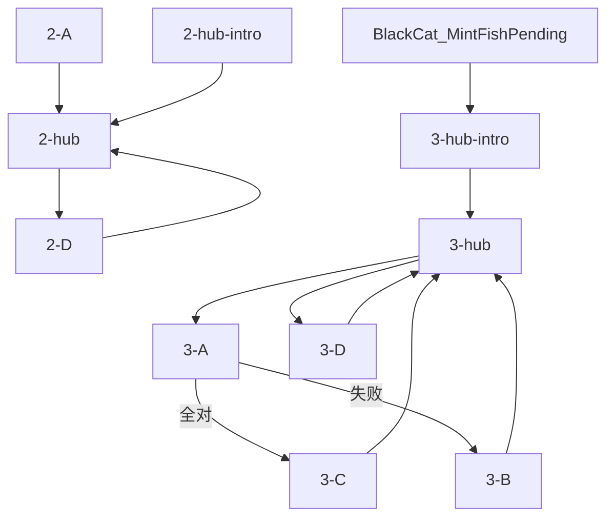

# 悲伤蛙 · 对话脚本（树状）

> **状态**：悲伤蛙对话**实施准稿**（以本树状脚本为准）。  
> **变量**：见 [17-全局游戏状态变量](../17-全局游戏状态变量.md)；本脚本只引用该表，不另造变量。跨 NPC 读写见 `17` §17.4 / §17.13。  
> **描述行**：text 树块内一律 `描述：（……）`，见 [18 §18.2](../18-树状对话脚本生成方法.md)。  
> **方法**：[18](../18-树状对话脚本生成方法.md) · [16](../16-NPC对话脚本书写守则.md)。

---

## 流程总览

**一、池塘 · 默认**

1. **2-A** 首访 → **2-hub【回访】+【菜单】**（不经 intro）
2. **点蛙**（首访后）→ **2-hub-intro【轮播】** → **2-hub**
3. **2-B**～**2-D** 播完 → **2-hub**（直进真 hub，不重播 intro）
4. **2-D** 水怪质询 → `Frog_WaterMonsterQueried` → **2-hub**

**二、薄荷鱼跑腿**

- 入口判定：`BlackCat_MintFishPending && !MintFish_Obtained` → **3-hub-intro** → **3-hub**
- **点蛙**（薄荷鱼阶段）：同上 intro → 真 hub；子项播完回 **3-hub** 短回访+菜单
- **3-A** 三轮对暗号 → **3-C** 或 **3-B** → 兜底 **3-D**

**二周目**：`NGPlus` → NGPlus【轮播】

变量写入见各节点【变量】；全局对照 [17 §17.13](../17-全局游戏状态变量.md#1713-悲伤蛙树状脚本速查)。



---

## 一、池塘

> 〔系统注〕点悲伤蛙时，**按序匹配**：
>
> 1. `NGPlus` → NGPlus【轮播】
> 2. `!Frog_FirstMeetShown` → **2-A** → **2-hub**（直进 hub，不经 intro）
> 3. `BlackCat_MintFishPending && !MintFish_Obtained` → **3-hub-intro** → **3-hub**
> 4. `Frog_FirstMeetShown` → **2-hub-intro** → **2-hub**  
>    （子项 **2-B**～**2-D** / **3-B**～**3-D** 出口**直进**对应真 hub，不经 intro）
>
> **场景**：`BeiShangWa.lua` 挂 parent，拖 `beforeSpot`（悲伤蛙1）/ `afterSpot`（悲伤蛙2）/ `cushionSpot`（E12 绿垫交互点）：`!MintFish_Obtained`→蛙1+E12；`MintFish_Obtained`（**3-C** / **3-D**）→蛙2，并 `DisableInteraction` 关掉 E12。

---

### 2-A · 首次对话

```text
2-A
│
└─ 描述：（一股刺鼻的草本甜味，混着池水腥气）
   悲伤蛙·丧：……你来了。
   悲伤蛙·丧：或者……你只是路过这片死水。
   玩家：……这里是你的地方？
   悲伤蛙·丧：这里是虚无的地方。
   悲伤蛙·丧：我在这儿坐了很久了。

→ 2-hub【回访】+【菜单】

【变量】
· Frog_FirstMeetShown = true
```

---

### 2-hub-intro · 点蛙人设轮播

> 〔系统注〕**点蛙**且 `Frog_FirstMeetShown` 时必播；**2-A** 出口**不经**本节点。子项 **2-B**～**2-D** 返回**不经**本节点。等权重随机一条，不重复相邻两条；播毕 → **2-hub**。

```text
2-hub-intro
│
├─ 【轮播】（!Frog_WaterMonsterQueried）
│  ├─ 描述：（水面纹丝不动）
│  │  悲伤蛙·丧：今天的水……跟昨天的水一样。
│  │  悲伤蛙·丧：但昨天已经消失了。
│  │  悲伤蛙·介入：所以其实……不一样。
│  │
│  ├─ 玩家：……你好。
│  │  悲伤蛙·丧：好什么好。
│  │  描述：（水面重归沉默）
│  │  悲伤蛙·丧：……来过就是来过。
│  │
│  ├─ 悲伤蛙·丧：活着，就是在等一个不会来的东西。
│  │  玩家：等……什么？
│  │  悲伤蛙·介入：不知道。
│  │  悲伤蛙·丧：可感觉上，就是在等。
│  │
│  └─ 玩家：农场里出事了……
│     悲伤蛙·丧：一直在出事。
│     悲伤蛙·丧：只是你们才刚注意到。
│
└─ 【轮播】（Frog_WaterMonsterQueried）
   ├─ 描述：（蛙重新盯向水面，不再看过来）
   │  悲伤蛙·丧：你已经知道了。
   │  悲伤蛙·丧：但知道了也没有用。
   │
   ├─ 悲伤蛙·丧：……虚无不会因为被发现而消失。
   │
   └─ 玩家：……你还好吗？
      悲伤蛙·介入：还好，是一种很奢侈的状态。

→ 2-hub【回访】+【菜单】
```

---

### 2-hub · 主菜单 hub（单句 + 菜单）

> 〔系统注〕**真 hub**：intro 播毕或子项返回时进入。【回访】由**入口判定/intro 链** vs **子项出口**区分，不设 bool。

```text
2-hub
│
├─ 【回访】（intro 播毕 / 入口判定 / **2-A** 直进）
│  悲伤蛙·丧：……
│
├─ 【回访】（子项 **2-B**～**2-D** 返 hub）
│  悲伤蛙·丧：……还有事吗？
│
└─ 【菜单】
   「水怪……这池塘里真的有水怪？」（ChickStatus>=2 && !Frog_WaterMonsterQueried）→ 2-D
   「这里有没有见过……一颗蛋？」（Shufen_CommissionDone && !Frog_EggAsked）→ 2-B
   「谷仓那边……你去过吗？」（E07_ViewNapSpot && !Frog_NapSpotAsked）→ 2-C
   「……」（告辞）→ 对话结束
```

---

### 2-B · 可选闲聊 · 蛋

> 〔系统注〕须已接淑芬委托（`Shufen_CommissionDone`）；否则玩家尚不知「蛋」为何案。

```text
2-B
│
└─ 玩家：这里有没有见过……一颗蛋？
   悲伤蛙·丧：蛋……什么蛋。
   悲伤蛙·丧：这片水里，早就没有新生了。
   玩家：所以是……有，还是没有？
   悲伤蛙·丧：问错了人。

→ 2-hub【回访】+【菜单】

【变量】
· Frog_EggAsked = true
```

---

### 2-C · 可选闲聊 · 谷仓

> 〔系统注〕须持【谷仓午睡点】（`E07_ViewNapSpot`）；一次性，播毕写 `Frog_NapSpotAsked`。

```text
2-C
│
└─ 玩家：谷仓那边……你去过吗？
   悲伤蛙·丧：我只趴水边。
   悲伤蛙·丧：离水远的地方……连虚无都是干的。

→ 2-hub【回访】+【菜单】

【变量】
· Frog_NapSpotAsked = true
```

---

### 2-D · 水怪质询（三证词）

```text
2-D
│
└─ 玩家：水怪……这池塘里真的有水怪？
   描述：（蛙缓缓转头，目光第一次落过来，却散着）
   悲伤蛙·介入：水怪。
   悲伤蛙·介入：……没有水怪。
   悲伤蛙·介入：但有比水怪更让人心碎的东西。
   悲伤蛙·介入：这片水……看着一样接一样地消失。
   描述：（水面平静，什么痕迹都没留下）
   悲伤蛙·介入：纯净，第一个死去。
   悲伤蛙·介入：然后……冰冷的器皿来了。
   描述：（蛙低头盯着水面，久久不抬）
   悲伤蛙·介入：生命之源……在枯竭。
   悲伤蛙·丧：一个黑色的恶魔……
   描述：（蛙喉咙动了一下，又哑住）
   悲伤蛙·介入：它带走了宝珠。
   悲伤蛙·丧：什么都不剩。
   玩家：……你到底在说什么。

→ 2-hub【回访】+【菜单】

【变量】
· Frog_WaterMonsterQueried = true
```

---

## 二、薄荷鱼跑腿

> 〔系统注〕`BlackCat_MintFishPending && !MintFish_Obtained` 时，点蛙走入口判定第 **3** 条 → **3-hub-intro** → **3-hub**（不经 **2-hub**）。  
> 索要路径 A：`E12_ViewGreenPad` · 路径 B：`Mouse_MintFishPaid`（可当场补录绿垫条目）。

---

### 3-hub-intro · 薄荷鱼阶段开场

> 〔系统注〕点蛙走入口判定第 **3** 条进入时必播；子项 **3-B**～**3-D** 返回不经本节点。播毕 → **3-hub**。

```text
3-hub-intro
│
└─ 悲伤蛙·丧：……又有东西来了。
   悲伤蛙·丧：或者……又有东西要走了。

→ 3-hub【回访】+【菜单】
```

---

### 3-hub · 薄荷鱼阶段 hub（单句 + 菜单）

> 〔系统注〕**真 hub**：intro 播毕或子项返回时进入。【回访】由 intro 链 vs 子项出口区分，不设 bool。

```text
3-hub
│
├─ 【回访】（intro 播毕 / 入口判定）
│  悲伤蛙·丧：……
│
├─ 【回访】（子项 **3-B**～**3-D** 返 hub）
│  悲伤蛙·丧：……嗯。
│
└─ 【菜单】
   「你身下那块绿垫子……能给我吗？」（(E12_ViewGreenPad || Mouse_MintFishPaid) && !Frog_PadRefused && !MintFish_Obtained）→ 3-A
   「……我见过好多只跟你一样的蛙。」（Mouse_FrogFallbackGiven && !MintFish_Obtained）→ 3-D
   「……」（告辞）→ 对话结束
```

---

### 3-A · 对暗号（三轮）

> 〔系统注〕路径 B 且 `!E12_ViewGreenPad` 时开场描述补录绿垫条目。每轮：**A** 正经直白 · **B** 谜语不到位 · **C** 到位；选 A/B → **3-B**。

```text
3-A
│
└─ 玩家：你身下那块绿垫子……能给我吗？
   描述：（蛙身下压着绿油油的东西，一阵草本甜气从那里飘过来）
   描述：（蛙低头看了一眼身下，再抬头，目光仍散着）
   悲伤蛙·丧：……你来这里，是因为什么？
   【菜单 · 第一轮】
│  「我来拿你身下那块绿垫子。」→ 3-B
│  「因为我在找丢失的蛋。」→ 3-B
│  「……不知道。感觉到了，就来了。」→ 继续第二轮
└─ 描述：（蛙没有立刻回应，视线在水面上停了一会儿）
   悲伤蛙·介入：你懂什么叫失去吗？
   【菜单 · 第二轮】
│  「懂。丢了还能找回来。」→ 3-B
│  「懂。我丢过重要的东西。」→ 3-B
│  「……不懂。或者说，懂了又怎样。」→ 继续第三轮
└─ 描述：（蛙视线从水面慢慢移到身下，又移回来）
   悲伤蛙·介入：它一直陪着我……直到现在。
   【菜单 · 第三轮】
│  「那你留着吧。我不拿了。」→ 3-B
│  「但它现在该让人带走了。」→ 3-B
│  「……陪着，也是一种消耗。」→ 3-C
```

---

### 3-B · 对暗号失败

```text
3-B
│
└─ 描述：（蛙重新盯向水面，不再看过来）
   悲伤蛙·丧：……你还没懂。

→ 3-hub【回访】+【菜单】

【变量】
· Frog_PadRefused = true
```

---

### 3-C · 成功交出薄荷鱼

```text
3-C
│
└─ 描述：（蛙缓缓挪开身体，绿色的东西露出来，草本甜气骤然加重）
   悲伤蛙·介入：……拿去吧。
   悲伤蛙·介入：它散发着腐朽又甜的气味……
   悲伤蛙·介入：像生命流走时，那种让人发晕的气息。
   悲伤蛙·介入：既然你要把这片虚无收走……
   描述：（蛙重新望向水面，眼神比刚才更空）
   悲伤蛙·介入：……那就都给你。
   玩家：这东西……你一直坐在上面？
   悲伤蛙·丧：它和我一样……正在腐烂。
   悲伤蛙·介入：但至少还留着气味。
   悲伤蛙·丧：证明曾经存在过。
   描述：（一阵风掠过，水面荡开，月影散了又聚）

→ 3-hub【回访】+【菜单】

【变量】
· MintFish_Obtained = true
```

---

### 3-D · 威胁路径「排第七」

```text
3-D
│
└─ 玩家：……我见过好多只跟你一样的蛙。
   描述：（蛙缓缓转头，目光第一次集中起来）
   悲伤蛙·介入：……什么？
   玩家：一样的台词，一样的姿势，一样的池塘。
   玩家：你是这个地区的第七名。
   描述：（蛙发呆了好几秒，眼睛猛地定住）
   悲伤蛙·介入：……第七。
   描述：（沉默片刻）
   悲伤蛙·介入：……第七？
   描述：（蛙低头，慢慢把身下的东西推了出来，不说话）
   描述：（蛙把身体偏向另一侧，不再看这边）

→ 3-hub【回访】+【菜单】

【变量】
· MintFish_Obtained = true
```

---

## 二周目

```text
NGPlus 回访
│
└─ 【轮播】
   ├─ 悲伤蛙·介入：宝珠……昨夜又浮上来了。
   │  悲伤蛙·介入：沉入深渊的，从来只是倒影。
   │  描述：（水面平静，月影完整）
   │
   ├─ 描述：（蛙没有转头）
   │  悲伤蛙·介入：黑色的恶魔……也许只是恨自己的倒影。
   │  悲伤蛙·介入：恨的，不止它一个。
   │
   ├─ 悲伤蛙·介入：生命之源……仍在被舀走。
   │  悲伤蛙·介入：虚无依然存在。
   │  玩家：……该查的，都查完了。
   │  悲伤蛙·介入：查完什么……虚无还是虚无。
   │
   └─ 悲伤蛙·介入：那块腐朽浮木走了……
      悲伤蛙·介入：身下空了，冰凉。
      描述：（蛙叹了一口气）
      悲伤蛙·介入：……倒也契合。

→ 对话结束
```

> 〔系统注〕二周目 `NGPlus` 下薄荷鱼线必已完成，四条等权轮播，**不**再挂 `MintFish_Obtained` 条件。
---

## 条件覆盖自检

### 入口判定

`NGPlus`→NGPlus【轮播】 · `!Frog_FirstMeetShown`→**2-A**→**2-hub** · `BlackCat_MintFishPending&&!MintFish_Obtained`→**3-hub-intro**→**3-hub** · `Frog_FirstMeetShown`→**2-hub-intro**→**2-hub** · 子项返 hub **直进**真 hub

> **hub 子树**：**2-B**～**2-D** / **3-A**～**3-D** 返链不写入口层 flag（`Frog_FirstMeetShown` · `BlackCat_MintFishPending` 等）；**3-hub** 菜单互斥仍写 `!MintFish_Obtained`。

### 节点 / 菜单 / 返链


| 节点 | 进入（读取） | 菜单项 / 分支 | 下一跳（写入后） |
| --- | --- | --- | --- |
| **2-A** | `!Frog_FirstMeetShown` | — | **2-hub** · `Frog_FirstMeetShown` |
| **2-hub-intro** | 点蛙入口判定（**不经** **2-A**） | 【轮播】 | **2-hub【回访】+【菜单】** |
| **2-hub** | intro 播毕或子项返回 | 质询/可选/告辞 | intro 后单句+【菜单】；子项返「……还有事吗？」+【菜单】 |
| **2-B** | hub · `Shufen_CommissionDone` · `!Frog_EggAsked` | — | **2-hub** · `Frog_EggAsked` |
| **2-C** | hub · `E07` · `!Frog_NapSpotAsked` | — | **2-hub** · `Frog_NapSpotAsked` |
| **2-D** | hub · `ChickStatus>=2` · `!Frog_WaterMonsterQueried` | — | **2-hub** · `Frog_WaterMonsterQueried` |
| **3-hub-intro** | 入口判定第 **3** 条 · 点蛙 | — | **3-hub【回访】+【菜单】** |
| **3-hub** | intro 播毕或子项返回 | 索要/威胁/告辞 | intro 后单句+【菜单】；子项返「……嗯。」+【菜单】 |
| **3-A** | **3-hub** 菜单 | 三轮 | **3-C** / **3-B** |
| **3-B** | **3-A** 选 A/B | — | **3-hub** · `Frog_PadRefused` |
| **3-C** | **3-A** 三轮全 C | — | **3-hub** · `MintFish_Obtained` |
| **3-D** | **3-hub** · `Mouse_FrogFallbackGiven` · `!MintFish_Obtained` | — | **3-hub** · `MintFish_Obtained` |
| **NGPlus** | `NGPlus` | 四条等权【轮播】 | 对话结束 |


**本脚本【变量】块（7 处）**：`2-A` `Frog_FirstMeetShown` · `2-B` `Frog_EggAsked` · `2-C` `Frog_NapSpotAsked` · `2-D` `Frog_WaterMonsterQueried` · `3-B` `Frog_PadRefused` · `3-C`/`3-D` `MintFish_Obtained`

---

*关联文档：[17](../17-全局游戏状态变量.md)、[13](../13-玩家线索与交互点总表.md)、[16](../16-NPC对话脚本书写守则.md)、[悲伤蛙](./悲伤蛙.md)*
