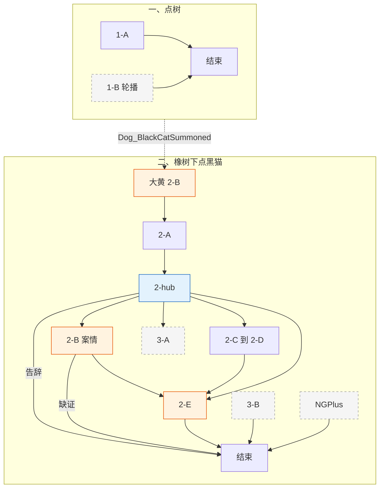

# 黑猫 · 对话脚本（树状）

> **状态**：黑猫对话**实施准稿**（以本树状脚本为准）。  
> **变量**：见 [17-全局游戏状态变量](../17-全局游戏状态变量.md)；本脚本只引用该表，不另造变量。  
> **描述行**：text 树块内一律 `描述：（……）`，见 [18 §18.2](../18-树状对话脚本生成方法.md)。  
> **方法**：[18](../18-树状对话脚本生成方法.md) · [16](../16-NPC对话脚本书写守则.md)。

---

## 流程总览

**一、大橡树（第一章 · 树上独白）**

> **地点**为大橡树；**交互对象**分两种：**点树**（第一章隐藏独白，说话方「大树」）与 **点树下黑猫 NPC**（第二章起，见下节）。二者勿混。

1. **1-A** 首次**靠近**大橡树 → 强制播 → `BlackCat_TreeHardShown=true` → **对话结束**
2. **1-B** **点击大树**【轮播】；`Dog_BlackCatSummoned` 后**不可再点树**（改点黑猫）

**二、大橡树下（第二章 · 点黑猫 NPC）**

> 场景仍在橡树下，**交互对象是黑猫**（`Dog_BlackCatSummoned` 后）；**2-A** 接大黄 **2-B** 后播。

1. **2-A** 被晃下树（大黄 **2-B** 出口）→ **2-hub【回访】+【菜单】**
2. **2-hub** 谈判 hub：案情 **2-B** / 薄荷鱼 **2-C**→**2-D** / 揭穿 **3-A**（菜单）· 告辞结束；**3-B** 漫画收束后走入口判定直进
3. **2-B** 案情开场（只一次：空窝 + 鼻子）→ 未问蛙硬卡 / 已问蛙讲证词 → 无门外物证卡点 / 有物证→**2-B-hub**；之后凡推进一律经「还有新线索」分阶（**2-B-R-frog** / **2-B-R-chick** / **2-B-F** / **2-B-R** / **2-B-hub**）→ **2-B-A** / **2-B-B** → **2-B-C** → **2-hub** 或 **2-E**
4. **2-C** 薄荷鱼线 → `BlackCat_MintFishPending` →（老鼠 / 蛙线）→ **2-C-D** 蛙败兜底（可选）→ **2-D** 交还 → **2-hub** 或 **2-E**
5. **2-E** 双路汇合起身开窗（`BlackCat_CaseLineDone && BlackCat_MintFishLineDone`）→ `BlackCat_Entered=true` → **对话结束**
6. **2-F** 攻顶途中 **E37 / E38** 路径喊话点（**点击交互**，非强制播）

**三、揭穿黑幕（可选）**

- **3-A** 早触发（hub 菜单 · 推理路径）
- **3-B** 晚触发（黑猫入口判定 · `Comic_Revealed` 兜底）

**二周目**：`NGPlus` → 点**树下黑猫** → **NGPlus 回访**【轮播】（入口上 **3-B** 优先于 `NGPlus`）

变量写入见各节点【变量】；全局对照 [17 §17.9](../17-全局游戏状态变量.md#179-黑猫树状脚本速查与样章对齐)。

### 分章流程图




**图例**：橙色 = 关键质询 / 切场；蓝色 = hub。**3-B** / **NGPlus** 见 §二「点黑猫时进哪段对话」；**2-C** 取物经老鼠 / 蛙线；**2-F** = **E37/E38 点击交互**（非强制播）。

**对话结束**：大树 **1-A** / **1-B** · **2-B** 青蛙/门外卡点 · **2-B-R-frog** / **2-B-R-chick** / **2-B-R** / **2-B-D** · **2-hub** 告辞 · **2-E** · **NGPlus** 写「→ 对话结束」；**2-A**→**2-hub**、子项回 hub、**2-B-C**/**2-D**→**2-E** 等不写。

---

## 一、大橡树

> 〔系统注〕第一章黑猫躲树冠，**不可见、不可点 NPC**。交互分两种：
>
> - **大树 1-A**（`!BlackCat_TreeHardShown`）：进入大橡树范围 → **强制播放**（不需按交互键）。
> - **大树 1-B**（`BlackCat_TreeHardShown` 且 `!Dog_BlackCatSummoned`）：**点击大树** →【轮播】。
> - **大黄已摇树**（`Dog_BlackCatSummoned`）：大树不再回应，改**点树下黑猫**。

---

### 1-A · 首次靠近（强制播放）

> 〔系统注〕首次进入大橡树交互范围**自动播**，只一次；不需按交互键。伏笔句全玩家必听过。

```text
1-A
│
└─ 大树：傻子在炫耀，瞎子在到处问。
   玩家：谁？大树？大树说话了？
   大树：咳……是本树在说话。
   玩家：你刚才说的傻子和瞎子——到底是谁？
   大树：……走吧，凡人。别踩我的根。

→ 对话结束

【变量】
· BlackCat_TreeHardShown = true
```

---

### 1-B · 点击大树（轮播）

> 〔系统注〕玩家**点击大树**进入。`BlackCat_TreeHardShown`。等权重【轮播】；`DogStatus>=2` 时「屋顶蠢东西」「凌晨四点」两条入池。

```text
1-B
│
└─ 【轮播】
   ├─ 玩家：大树？
   │  大树：你踩到我的根了。
   │  玩家：哦，对不起。
   │  大树：……
   │  大树：无趣。
   │
   ├─ 玩家：大树，农场里出大事了，你知道吗？
   │  大树：吵。
   │  玩家：什么吵？
   │  大树：你说话，吵。
   │
   ├─ 玩家：大树你每天在这里，能看到什么？
   │  大树：凡人……只会看见想看见的。
   │  玩家：……听不太懂。
   │  大树：走吧。
   │
   ├─ 【条件】（DogStatus>=2）
   │  玩家：大树，谷仓屋顶上是不是有什么东西？
   │  大树：屋顶那只蠢鸟，还守着它的宝贝。
   │  玩家：什么宝贝？
   │  大树：有什么好守的。
   │  玩家：你是说乌鸦吗？
   │  大树：本树不指名道姓。
   │
   └─ 【条件】（DogStatus>=2）
      玩家：大树，你有没有听到什么奇怪的声音？
      大树：谷仓顶上那个，天没亮又叫起来了……
      玩家：谁在叫？
      大树：每天四点。叫了三年。
      大树：……走吧。

→ 对话结束
```

---

## 二、大橡树下

> 〔系统注〕**地点**是大橡树下，**点的是黑猫 NPC**（`Dog_BlackCatSummoned` 之后才有）。玩家点黑猫时，**从上到下看哪条符合，就进哪段对话**（不是菜单里排第几条）：
>
> - **漫画演完、还没揭穿「早知石头」**（`Comic_Revealed && !BlackCat_StoneRevealShown`）：进 **3-B**，补问揭穿，对话结束。（**优先于** `NGPlus`；黑猫可能已进屋，仍可点。）
> - **二周目**（`NGPlus`）：进 **NGPlus 回访**，播释怀盘，对话结束。（只点黑猫，不点树；须已揭穿或跳过 **3-B** 窗口。）
> - **案情线和薄荷鱼线都谈完了、黑猫还没进屋**（`BlackCat_CaseLineDone && BlackCat_MintFishLineDone && !BlackCat_Entered`）：进 **2-E** 汇合开窗，对话结束。
> - **大黄摇过树、黑猫还在树下**（`Dog_BlackCatSummoned && !BlackCat_Entered`）：进 **2-hub** 谈判菜单。
> - **黑猫已经钻进屋里了**（`BlackCat_Entered`）：树下黑猫不可再点；攻顶途中放话见 **2-F**（E37 / E38），不经过点击。
>
> **2-A** 只在大黄 **2-B** 摇树演出里播，玩家不能单独点进。
>
> **2-hub 子树**：自 **2-hub** 至其子节点（**2-B**～**2-D**、**3-A**）的菜单与返链**不写** `!BlackCat_Entered`——能进入子树即表示黑猫仍在树下、尚未播 **2-E**；`BlackCat_Entered` 仅用于**点黑猫入口判定**（防 **2-E** 重播、漫画后分流）及**大黄** `2-C` / `2-E` 分流。

---

### 2-A · 现身：被晃下树

> 〔系统注〕衔接大黄 **2-B** → **2-hub【回访】+【菜单】**。

```text
2-A
│
└─ 描述：（树冠剧烈颤动，一只黑猫从树上落地，毛发炸乱，白眼一翻）
   黑猫·炸毛：滚——开！
   黑猫·炸毛：没看到本喵正为被骗的事疗伤吗？！
   玩家：等等……这声音……
   玩家：你就是那棵大树！！
   黑猫·炸毛：……是猫。
   描述：（大黄压低声音）
   大黄·执勤：你跟大树说话了？
   玩家：我以为……是大树在说话……
   描述：（黑猫深吸一口气，抬爪梳了两下乱毛，没梳平，更烦）
   黑猫·炸毛：那个该死的两脚兽！
   黑猫·炸毛：昨晚装得可温柔，骗本喵放松——
   黑猫·炸毛：他把本喵捧起来，本喵以为是要按摩——
   黑猫·炸毛：一转眼就把本喵搁在冰冷地板上！
   黑猫·炸毛：抢走本喵的御用软垫！
   玩家：啊……那挺过分的。
   黑猫·炸毛：还有你！
   描述：（黑猫视线漫不经心扫过大黄）
   黑猫·炸毛：……那只鸟叫你地毯呢。
   大黄·执勤：什么？！
   黑猫·炸毛：……没听错吧。
   描述：（停顿一秒）
   黑猫·炸毛：你还把树晃成那样？！这是什么不文明的手段？！
   大黄·执勤：不摇你不下来嘛。
   描述：（黑猫视线缓缓滑过来，停住）
   黑猫·炸毛：……你又是谁？
   玩家：我是侦探，在调查淑芬的蛋失踪案。
   黑猫·高傲：鸡的事，和本喵有什么关系。
   描述：（黑猫在橡树根旁蹲下，尾巴慢慢扫地，没挪窝）

→ 2-hub【回访】+【菜单】

【变量】
· Dog_BlackCatSummoned = true
```

---

### 2-hub · 树下谈判

> 〔系统注〕`Dog_BlackCatSummoned && !BlackCat_Entered`。先播【回访】，同屏【菜单】。  
> 若案情、薄荷鱼两路都已齐，再点黑猫时**不进 hub**，直进 **2-E**（入口判定见章首，含 `!BlackCat_Entered`）。  
> **案情项分流**：  
> - `!BlackCat_CaseLineStarted` → **2-B**（「蛋的线索……」，只一次）  
> - `Started && !Done` →「我还有新发现要跟你说。」（**按序**）：
>   1. `!Frog_WaterMonsterQueried && ChickStatus<3` → **2-B-R-frog**
>   2. `!Frog_WaterMonsterQueried && ChickStatus>=3` → **2-B-R-chick**
>   3. `Frog_WaterMonsterQueried && !BlackCat_CaseLineFrogSaid` → **2-B-F**
>   4. `BlackCat_CaseLineFrogSaid && !E17 && !E18` → **2-B-R**
>   5. `BlackCat_CaseLineFrogSaid && (E17 || E18)` → **2-B-hub**
> 卡点后**不重播** **2-B** 开场。

```text
2-hub
│
├─ 【回访】
│  黑猫·高傲：……
│
└─ 【菜单】
   「我查到的，都指向红顶屋里面。」（!BlackCat_CaseLineDone && !BlackCat_CaseLineStarted）→ 2-B
   「我还有新发现要跟你说。」（!BlackCat_CaseLineDone && BlackCat_CaseLineStarted）→ 分阶见上（2-B-R-frog / 2-B-R-chick / 2-B-F / 2-B-R / 2-B-hub）
   「谷仓那草窝……是你的吧。」（E07_ViewNapSpot && E08_ViewBurnMark && !BlackCat_MintFishPending）→ 2-C
   「有关你要我办的那件事。」（BlackCat_MintFishPending && !MintFish_Obtained && Frog_PadRefused && !Mouse_FrogFallbackGiven）→ 2-C-D
   「你要的东西，我还在想办法。」（BlackCat_MintFishPending && !MintFish_Obtained）→ 2-C-R
   「找回来了。」（BlackCat_MintFishPending && MintFish_Obtained && !BlackCat_MintFishLineDone）→ 2-D
   「你上谷仓屋顶那次——」（!BlackCat_StoneRevealShown && E10_ViewWhiteStone && BlackCat_MintFishLineDone）→ 3-A
   「先不打扰你了。」→ 对话结束
```

> 〔系统注〕**3-A** 仅 **2-hub**【菜单】、**2-E** 起身前；需 `E10_ViewWhiteStone`。**3-B** 不进 hub——漫画后点黑猫走入口判定直进（见章首说明）；与 **3-A** 共用 `BlackCat_StoneRevealShown`。

---

### 2-B · 案情汇报线 · 开场必播

> 〔系统注〕`!BlackCat_CaseLineStarted`。从 **2-hub** 选「蛋的线索……」**只进入一次**；之后推进一律走「还有新线索」。  
> **硬必事实顺序**（见 `16`）：空窝无闯入 · 大黄嗅觉确认蛋味仍在红顶屋内 · **须已问蛙**（`Frog_WaterMonsterQueried`）再报池塘「冰冷容器 / 生命之源」· 再齐 **E17/E18** 物证。  
> 播完空窝+鼻子后写 `BlackCat_CaseLineStarted=true`。未问蛙 = **硬卡**，禁止弱表述编造打水目击。玩家只列事实、不下结论（禁保温箱 / 孵化等揭晓词）。

```text
2-B
│
└─ 玩家：我查到的，都指向红顶屋里面。
   黑猫·审视：……说来听听。
   黑猫·高傲：本喵可不保证爱听。
   玩家：淑芬今天早上醒来，蛋不见了。
   黑猫·审视：……然后呢。
   玩家：但窝里没有打斗迹象，没有外来气味，也没有拖拽痕迹。
   黑猫·审视：窝里没打斗，也没拖拽痕迹。
   黑猫·审视：自己跑走的？
   玩家：大黄的鼻子刚恢复，
   玩家：他说蛋的气味现在还从红顶屋里飘出来。
   黑猫·高傲：那只蠢狗的鼻子，在这件事上倒是有用。

【变量】
· BlackCat_CaseLineStarted = true
   │
   ├─ 【条件】（!Frog_WaterMonsterQueried）
   │  黑猫·审视：有一群小鸡这两天一直在叽叽喳喳的，
   │  黑猫·审视：你去了解一下发生什么了。
   │  玩家：行，我先找小鸡问清楚。
   │  → 对话结束
   │
   └─ 【条件】（Frog_WaterMonsterQueried）
      玩家：还有昨晚悲伤蛙看见了什么——
      玩家：高大的两脚兽，带着冰冷的容器，
      玩家：把什么「生命之源」从池塘抽走了。
      黑猫·审视：……那只蛤蟆的措辞一向如诗如画。
      描述：（黑猫没作声，眼珠子慢慢转）
      黑猫·审视：但「冰冷的容器」和「生命之源」——对得上什么，你继续说。
      黑猫·审视：继续。

【变量】
· BlackCat_CaseLineFrogSaid = true
      │
      ├─ 【条件】（!E17_ViewEmptyBucket && !E18_ViewBootprints）
      │  黑猫·审视：池塘那边有人打水——红顶屋门外，能拿出什么证明？
      │  玩家：……我再去红顶屋门外看看。
      │  黑猫·高傲：去吧。
      │  → 对话结束
      │
      └─ 【条件】（E17_ViewEmptyBucket || E18_ViewBootprints）
         → 2-B-hub【回访】+【菜单】
```

---

### 2-B-R-frog · 催问小鸡（补证回访）

> 〔系统注〕`BlackCat_CaseLineStarted && !BlackCat_CaseLineDone && !Frog_WaterMonsterQueried && ChickStatus<3`。  
> 自 **2-hub**「我还有新发现要跟你说。」**第 1 阶**（尚未问清小鸡）。催去问**小鸡**；**不**提池塘；**不**重播 **2-B** 开场。

```text
2-B-R-frog
│
└─ 玩家：我还有新发现要跟你说。
   黑猫·审视：小鸡那边问清楚了吗？
   黑猫·高傲：它们这两天吵个不停——先把那边弄明白。
   → 对话结束
```

---

### 2-B-R-chick · 小鸡已招 · 催问悲伤蛙

> 〔系统注〕`BlackCat_CaseLineStarted && !BlackCat_CaseLineDone && !Frog_WaterMonsterQueried && ChickStatus>=3`。  
> 自 **2-hub**「还有新线索」**第 1 阶**（补漏/招供后、尚未问蛙）。黑猫问小鸡怎么说 → 玩家转述 → 再催去池塘问蛙。

```text
2-B-R-chick
│
└─ 玩家：我还有新发现要跟你说。
   黑猫·审视：小鸡那边怎么说。
   玩家：它们招了——大前天趁乱把弟弟推回窝里了；
   玩家：屋顶那块白石头是它们自己画的，乌鸦大前天就叼走了。弟弟昨晚才不见——它们叫我去池塘问青蛙。
   黑猫·审视：……去问那只蛤蟆。昨夜池塘边它看见了什么，问清楚再来。
   → 对话结束
```

---

### 2-B-F · 补讲青蛙证词

> 〔系统注〕`Started && !Done && Frog_WaterMonsterQueried && !BlackCat_CaseLineFrogSaid`。  
> 自 **2-hub**「还有新线索」**第 2 阶**。玩家已问蛙、案情线尚未讲过青蛙证词；讲完写 `BlackCat_CaseLineFrogSaid`，再走与 **2-B** 相同的门外物证门控。

```text
2-B-F
│
└─ 玩家：我还有新发现要跟你说。
   黑猫·审视：……说。
   玩家：还有昨晚悲伤蛙看见了什么——
   玩家：高大的两脚兽，带着冰冷的容器，
   玩家：把什么「生命之源」从池塘抽走了。
   黑猫·审视：……那只蛤蟆的措辞一向如诗如画。
   描述：（黑猫没作声，眼珠子慢慢转）
   黑猫·审视：但「冰冷的容器」和「生命之源」——对得上什么，你继续说。
   黑猫·审视：继续。

【变量】
· BlackCat_CaseLineFrogSaid = true
   │
   ├─ 【条件】（!E17_ViewEmptyBucket && !E18_ViewBootprints）
   │  黑猫·审视：池塘那边有人打水——红顶屋门外，能拿出什么证明？
   │  玩家：……我再去红顶屋门外看看。
   │  黑猫·高傲：去吧。
   │  → 对话结束
   │
   └─ 【条件】（E17_ViewEmptyBucket || E18_ViewBootprints）
      → 2-B-hub【回访】+【菜单】
```

---

### 2-B-R · 催门外物证（补证回访）

> 〔系统注〕`Started && !Done && BlackCat_CaseLineFrogSaid && !E17_ViewEmptyBucket && !E18_ViewBootprints`。  
> 自 **2-hub**「还有新线索」**第 3 阶**。青蛙证词已进案情线，缺门外物证；点明红顶屋**门旁空水桶**与**门前雨靴脚印**后结束。

```text
2-B-R
│
└─ 玩家：我还有新发现要跟你说。
   黑猫·审视：门外那两样呢。
   黑猫·高傲：红顶屋门外——门旁的空水桶，门前的雨靴印。看清楚了再来。
   → 对话结束
```

---

### 2-B-hub · 物证菜单

> 〔系统注〕`Started && !Done && BlackCat_CaseLineFrogSaid && (E17 || E18)`。  
> **入口**：**2-B** / **2-B-F** 播毕（已有物证）· **2-hub** 补证第 4 阶 · **2-B-A** / **2-B-B** 播毕回 hub。  
> 未问蛙 / 未讲青蛙证词 / 无门外物证时**不**进本 hub（走对应催查阶）。  
> 水桶 / 雨靴并列菜单，已播项隐藏；两项都播过 → **2-B-C**，不再回 hub。  
> 「先说到这儿。」在尚有一项未 Said 时可点（半进度须能离场去补另一物证）。  
> `E17` / `E18` 为红顶屋外勘察写入（见 `13`），不在本节点写入。

```text
2-B-hub
│
├─ 【回访】
│  黑猫·高傲：……
│
└─ 【菜单】
   「门旁空水桶，桶底池塘泥。」（E17_ViewEmptyBucket && !BlackCat_CaseLineBucketSaid）→ 2-B-A
   「雨靴脚印，夜里朝鸡窝方向。」（E18_ViewBootprints && !BlackCat_CaseLineBootSaid）→ 2-B-B
   「先说到这儿。」（!BlackCat_CaseLineBucketSaid || !BlackCat_CaseLineBootSaid）→ 2-B-D
```

---

### 2-B-A · 水桶

> 〔系统注〕`E17_ViewEmptyBucket && !BlackCat_CaseLineBucketSaid`（**2-B-hub**【菜单】）。

```text
2-B-A
│
└─ 玩家：门旁有个空水桶，桶底是池塘泥沙。
   描述：（黑猫视线落在来人身上，停了一秒）
   黑猫·审视：蛤蟆说的冰冷容器——就是这只桶。
   玩家：水桶刚装过池塘水，正好对上悲伤蛙说的「生命之源」。
   黑猫·审视：昨晚去池塘取水的人，之后回了这栋屋。
   描述：（黑猫尾巴慢了下来，不再扫地，只是压着）

→ 2-B-hub【回访】+【菜单】（!BlackCat_CaseLineBootSaid）
→ 2-B-C（BlackCat_CaseLineBootSaid）

【变量】
· BlackCat_CaseLineBucketSaid = true
```

---

### 2-B-B · 雨靴印

> 〔系统注〕`E18_ViewBootprints && !BlackCat_CaseLineBootSaid`（**2-B-hub**【菜单】）。

```text
2-B-B
│
└─ 玩家：门前的雨靴脚印，夜里朝鸡窝方向。
   描述：（黑猫停住）
   黑猫·审视：脚印朝鸡窝去。是夜里留下的。

→ 2-B-hub【回访】+【菜单】（!BlackCat_CaseLineBucketSaid）
→ 2-B-C（BlackCat_CaseLineBucketSaid）

【变量】
· BlackCat_CaseLineBootSaid = true
```

---

### 2-B-D · 卡点（先说到这儿）

> 〔系统注〕**2-B-hub**【菜单】「先说到这儿。」；`!BlackCat_CaseLineBucketSaid || !BlackCat_CaseLineBootSaid` 时可点（还有物证未在菜单里播完）。

```text
2-B-D
│
└─ 玩家：先说到这儿。
   黑猫·高傲：就汇报一件，不够。
   玩家：……我再去看看。
   黑猫·高傲：去吧。

→ 对话结束
```

---

### 2-B-C · 顿悟

> 〔系统注〕`BlackCat_CaseLineBucketSaid && BlackCat_CaseLineBootSaid`。由 **2-B-A** / **2-B-B** 第二项进入；无菜单入口。

```text
2-B-C
│
└─ 黑猫·审视：昨晚，有人去池塘取了水。
   黑猫·审视：然后，夜里去了鸡窝。
   黑猫·审视：现在，蛋的气味从红顶屋里飘出来。
   描述：（沉默）
   黑猫·审视：那家伙昨晚进鸡窝拿走了蛋。
   黑猫·审视：带进了红顶屋。
   玩家：但为什么？
   黑猫·高傲：……
   黑猫·高傲：本喵也想知道。
   描述：（站起来了一点，又坐回去）
   黑猫·审视：他在用那颗蛋做什么。

→ 2-hub【回访】+【菜单】（!BlackCat_MintFishLineDone）
→ 2-E（BlackCat_MintFishLineDone）

【变量】
· BlackCat_CaseLineDone = true
```

---

### 2-C · 薄荷鱼线 · 打开

> 〔系统注〕`E07_ViewNapSpot && E08_ViewBurnMark && !BlackCat_MintFishPending`（**2-hub**【菜单】）。玩家此时**还不知道**丢的是薄荷鱼，只察觉草窝、焦痕与老鼠有关。

```text
2-C
│
└─ 玩家：谷仓角落那里……那个草窝，是你的吧？
   玩家：旁边还有烧焦的稻草和皮毛。
   描述：（黑猫骤然抬眼，定住）
   黑猫·高傲：……你怎么知道那个。
   玩家：那个焦痕是怎么回事？
   黑猫·高傲：还不是那只死鸟——
   描述：（立刻收住）
   黑猫·高傲：……但那件事跟你无关。
   描述：（黑猫视线往红顶屋墙缝一飘，很快收回；尾巴尖弹了一下）
   玩家：跟老鼠有关系吗？
   黑猫·高傲：……你在乱猜什么。
   玩家：我帮你把这事办妥——你帮我开屋子。
   描述：（黑猫眯眼打量来人，好一会儿没吭声）
   黑猫·高傲：……
   黑猫·高傲：去找老鼠。
   黑猫·高傲：把东西找回来再说。

→ 2-hub【回访】+【菜单】

【变量】
· BlackCat_MintFishPending = true
```

> 〔系统注〕取回路径见 [老鼠兄弟-对话脚本](./老鼠兄弟-对话脚本.md) 薄荷鱼专线、[悲伤蛙-对话脚本](./悲伤蛙-对话脚本.md)；取得后写 `MintFish_Obtained`（蛙线 / 老鼠线，见 `17`）。黑猫派活时**不说物件名称**，玩家从老鼠 / 蛙处才知道是薄荷鱼。

---

### 2-C-D · 薄荷鱼线 · 蛙败兜底

> 〔系统注〕`BlackCat_MintFishPending && !MintFish_Obtained && Frog_PadRefused && !Mouse_FrogFallbackGiven`（**2-hub**【菜单】）。蛙 **3-B** 对暗号失败后、老鼠尚未给出「排第七」前；**不**写入变量，菜单随 `Mouse_FrogFallbackGiven` 自动消失。台词不分支（付没付过老鼠 8 块同一套）；黑猫**不说物件名称**、不教蛙谜题。

```text
2-C-D
│
└─ 玩家：有关你要我办的那件事。
   描述：（黑猫眼皮动了一下，仍蹲着）
   黑猫·高傲：……说。
   玩家：你要的东西，我找到了。
   描述：（黑猫耳朵竖起来，尾巴尖不受控地弹了一下）
   黑猫·高傲：在哪。
   玩家：绿油油的，带着一股冲鼻子的草本甜气——
   玩家：池塘里有只蛙一直坐在上面呢。
   描述：（黑猫往前倾了半寸，瞳孔放大，又立刻坐正）
   黑猫·审视：……然后呢。
   玩家：我当面讨，他不肯给。
   玩家：你有办法吗？
   描述：（黑猫顿住，胡须压平，一秒后又摆回傲慢脸）
   黑猫·高傲：怎么落到蛤蟆手里——本喵也不知道。
   黑猫·高傲：你拿不回来，就去找老鼠。
   黑猫·高傲：他们肯定有办法。

→ 2-hub【回访】+【菜单】
```

---

### 2-C-R · 薄荷鱼线 · 进度回访

> 〔系统注〕`BlackCat_MintFishPending && !MintFish_Obtained`（**2-hub**【菜单】）。取物途中暂退 hub 时的催办；不写变量。

```text
2-C-R
│
└─ 玩家：你要的东西，我还在想办法。
   黑猫·高傲：哼。本喵说过——去找老鼠。
   黑猫·高傲：东西拿回来之前，别想谈开门的事。

→ 2-hub【回访】+【菜单】
```

---

### 2-D · 交还薄荷鱼

> 〔系统注〕`BlackCat_MintFishPending && MintFish_Obtained && !BlackCat_MintFishLineDone`（**2-hub**【菜单】「找回来了。」，或持鱼自动高亮同项）。

```text
2-D
│
└─ 玩家：找回来了。
   描述：（薄荷鱼递出）
   描述：（黑猫耳朵竖起来，尾巴拍了两下——立刻压住）
   黑猫·高傲：……哼。
   描述：（慢慢走近，低头闻了一下，忍了一秒，吸了一大口——喉咙里半秒呼噜，骤然停住）
   黑猫·炸毛：喵……就是这个——不对！
   描述：（往后退半步，爪子压住鱼）
   黑猫·高傲：一条臭鱼，买不走本喵！
   大黄·醉倒：（小声）你刚才呼噜了……
   黑猫·高傲：你耳朵出问题了。

→ 2-hub【回访】+【菜单】（!BlackCat_CaseLineDone）
→ 2-E（BlackCat_CaseLineDone）

【变量】
· BlackCat_MintFishLineDone = true
```

---

### 2-E · 汇合：起身去开窗

> 〔系统注〕`BlackCat_CaseLineDone && BlackCat_MintFishLineDone && !BlackCat_Entered`（**点黑猫入口判定**；**2-B-C** / **2-D** 子树返链只写对应线 `Done`，见章首「2-hub 子树」）。播毕写 `BlackCat_Entered=true`；树下黑猫不可再点。大黄激将正文见下（原大黄样章 **2-D** 迁此）。

```text
2-E
│
└─ 大黄·执勤：猫大爷，昨晚的事你清楚吗？
   玩家：大黄，别说了……
   大黄·执勤：你可是被那个两脚兽当面骗了一手啊！
   大黄·执勤：整个农场都看着你睡得呼呼的、还以为是要给你按摩——
   黑猫·炸毛：……
   大黄·执勤：——醒来一看，软垫没了，自尊扫地！
   大黄·执勤：这要是传出去，今年冬天你睡稻草堆里，
   大黄·执勤：我可不让你蹭我狗窝。
   描述：（黑猫的尾巴猛地弹了一下，然后静止）
   描述：（非常缓慢地，从蹲位站起来；用眼神冻住大黄——大黄讪讪地把头转开）
   黑猫·炸毛：本喵不是因为那只发疯母鸡。
   黑猫·炸毛：也不是因为这条蠢狗指使。
   描述：（低头，用嘴叼起薄荷鱼）
   黑猫·炸毛：本喵要进屋查清——软垫被弄哪儿去了，那家伙昨晚又拿它做过什么。
   黑猫·审视：至于你说的那颗破蛋——
   黑猫·审视：既然那颗蛋多半还在屋里，顺便看一眼也不亏。
   黑猫·炸毛：看见了吗？阁楼那个窗子——要进来，你走那边。
   黑猫·炸毛：猫门是本喵的，你不许走。本喵钻进去，从里面给你推开。
   描述：（黑猫利落地钻进猫门）
   描述：（片刻后，红屋顶阁楼的窗子被从内推开，传来一声清脆的啪嗒）

→ 对话结束

【变量】
· BlackCat_Entered = true
```

> 〔系统注〕阁楼窗攻顶解锁；再点大黄走 **2-E**（见 [大黄-对话脚本-树状样章](./大黄-对话脚本-树状样章.md)）。攻顶途中 E37 / E38 播 **2-F**，不点黑猫。

---

### 2-F · 攻顶途中路径喊话（E37 / E38）

> 〔系统注〕**E37** / **E38**【氛围】**进范围强制播**（`DialogueAreaTrigger`，非点击）。入口须 `BlackCat_Entered`；播毕写 `E37_BlackCatTauntShown` / `E38_BlackCatTauntShown`（各一次性）。无菜单、无玩家台词。路径点 VFX 由 `ClimbPathPoint`（`pathId=roof`）在 `BlackCat_Entered` 后点亮。

**F-1**（E37 · 起跳后第一段）

```text
黑猫·高傲：别刮花屋檐。
黑猫·高傲：那是本喵晒太阳的位置。
描述：（屋里传来一声很轻的尾巴拍地声）
黑猫·高傲：你摔下去，本喵不会下去捡。

【变量】
· E37_BlackCatTauntShown = true
```

**F-2**（E38 · 接近阁楼窗之前）

```text
黑猫·高傲：阁楼的窗子开着。
黑猫·高傲：还在屋檐上磨蹭什么。
黑猫·高傲：本喵开始怀疑你和那只狗是同一种跳跃水平。

【变量】
· E38_BlackCatTauntShown = true
```

---

## 三、揭穿黑幕（可选）

### 3-A · 早触发

> 〔系统注〕**2-hub**【菜单】；`E10_ViewWhiteStone && BlackCat_MintFishLineDone && !BlackCat_StoneRevealShown`。

```text
3-A
│
└─ 玩家：你上谷仓屋顶那次——是不是已经知道那是块石头？
   描述：（黑猫停顿，舔了一下爪子）
   黑猫·高傲：嗯。今早在窗台上看见的——乌鸦往下俯冲，爪里那块白石头，晨光一照就闪。
   描述：（黑猫瞥了大黄一眼）
   黑猫·高傲：任何不瞎的都看得出来不是蛋。
   玩家：你为什么不说！！
   黑猫·高傲：那只乌鸦，每天早上四点开始嘎嘎嘎。
   黑猫·高傲：已经三年了。
   黑猫·高傲：让你多跑几圈，本喵觉得挺公平。
   描述：（黑猫偏头，嘴角微扬）
   黑猫·高傲：本喵在树上不是说过吗？
   黑猫·高傲：「傻子在炫耀，瞎子在到处问。」
   玩家：……等等。
   玩家：那句话是在说乌鸦和我？！
   黑猫·高傲：你以为本喵是在骂大树吗。

→ 2-hub【回访】+【菜单】

【变量】
· BlackCat_StoneRevealShown = true
```

---

### 3-B · 晚触发（兜底）

> 〔系统注〕`Comic_Revealed && !BlackCat_StoneRevealShown`。漫画收束后点黑猫走入口判定直进（见章首说明；**优先于** `NGPlus`；**不要求** `!BlackCat_Entered`）。播毕**对话结束**，不再进 **2-hub**。

```text
3-B
│
└─ 玩家：你之前上谷仓屋顶——那时候就知道是块石头，对不对？
   描述：（黑猫睨过来一眼）
   黑猫·高傲：……这才反应过来？
   黑猫·高傲：早上窗台就看见了。白石头，晨光一照，闪得很——
   黑猫·高傲：任何不瞎的都看得出来不是蛋。
   玩家：你为什么不说？！
   黑猫·高傲：那只乌鸦——每天凌晨四点，准时开叫。
   黑猫·高傲：三年了，本喵耳朵没聋过。
   黑猫·高傲：这会儿才来问——晚是晚了。
   黑猫·高傲：让你多跑几圈，本喵不觉得亏。

→ 对话结束

【变量】
· BlackCat_StoneRevealShown = true
```

---

## 二周目

> 〔系统注〕`NGPlus`。漫画合本后，玩家**点树下黑猫 NPC**（非常驻「点树」交互）触发 **NGPlus 回访**【轮播】，无推进。

```text
NGPlus 回访
│
└─ 【轮播】
   ├─ 黑猫·高傲：软垫回来了。
   │  黑猫·高傲：本喵勉强同意把那间屋子继续租给那家伙住。
   │  玩家：那颗蛋呢？
   │  黑猫·高傲：那颗破蛋……
   │  黑猫·高傲：本喵暂时替淑芬看着。
   │  黑猫·高傲：就这样。
   │
   └─ 玩家：你下次还会上那棵树吗？
      黑猫·高傲：本喵在树上休息，不是在说话。
      黑猫·高傲：下次别跟大树搭腔了。
      描述：（叼着薄荷鱼，尾巴高高翘起）

→ 对话结束
```

---

## 条件覆盖自检

### 入口判定

**点树（第一章）**：`Dog_BlackCatSummoned`→大树不回应 · `!BlackCat_TreeHardShown`→**1-A** · 否则→**1-B**

**点黑猫**：`Comic_Revealed&&!StoneRevealShown`→**3-B** · `NGPlus`→**NGPlus** · 双路齐且`!BlackCat_Entered`→**2-E** · `Dog_BlackCatSummoned&&!BlackCat_Entered`→**2-hub** · `BlackCat_Entered`→不可点

### 节点 / 菜单 / 返链


| 节点          | 进入（读取）                                    | 出口                             | 写入                            |
| ----------- | ----------------------------------------- | ------------------------------ | ----------------------------- |
| **1-A**     | 大树入口判定                                    | 结束                             | `BlackCat_TreeHardShown`      |
| **1-B**     | 大树入口判定                                    | 结束                             | —                             |
| **2-A**     | 大黄 **2-B**                                | **2-hub**                      | `Dog_BlackCatSummoned`        |
| **2-hub**   | `Dog_BlackCatSummoned&&!BlackCat_Entered` | 子项 / 告辞→结束；入口判定双路齐→**2-E**     | —                             |
| **2-B**     | `!BlackCat_CaseLineStarted`（**2-hub** 菜单） | 未问蛙→结束；已问蛙无门外物证→结束；有物证→**2-B-hub** | `CaseLineStarted`（空窝+鼻子后）；有蛙则兼写 `CaseLineFrogSaid` |
| **2-B-R-frog** | **2-hub**「还有新线索」· `Started && !Done && !Frog_WaterMonsterQueried && ChickStatus<3` | 结束 | — |
| **2-B-R-chick** | **2-hub**「还有新线索」· `Started && !Done && !Frog_WaterMonsterQueried && ChickStatus>=3` | 结束 | — |
| **2-B-F**   | **2-hub**「还有新线索」· `Started && !Done && Frog && !CaseLineFrogSaid` | 无门外物证→结束；有物证→**2-B-hub** | `BlackCat_CaseLineFrogSaid` |
| **2-B-R**   | **2-hub**「还有新线索」· `Started && !Done && FrogSaid && !E17 && !E18` | 结束 | — |
| **2-B-hub** | `Started && !Done && FrogSaid && (E17 或 E18)` | 子项 / **2-B-D**→结束；齐项→**2-B-C** | —                             |
| **2-B-A**   | **2-B-hub** 菜单                            | **2-B-hub** 或 **2-B-C**        | `BlackCat_CaseLineBucketSaid` |
| **2-B-B**   | **2-B-hub** 菜单                            | **2-B-hub** 或 **2-B-C**        | `BlackCat_CaseLineBootSaid`   |
| **2-B-D**   | **2-B-hub** 菜单                            | 结束                             | —                             |
| **2-B-C**   | **2-B-A**/**2-B-B**                       | **2-hub** 或 **2-E**            | `BlackCat_CaseLineDone`       |
| **2-C**     | hub 菜单                                    | **2-hub**                      | `BlackCat_MintFishPending`    |
| **2-C-D**   | hub 菜单 · 蛙败且未拿兜底口令                        | **2-hub**                      | —                             |
| **2-C-R**   | hub 菜单 · 取物途中进度回访                          | **2-hub**                      | —                             |
| **2-D**     | hub 菜单                                    | **2-hub**或**2-E**              | `BlackCat_MintFishLineDone`   |
| **2-E**     | 黑猫入口判定 / **2-B-C** / **2-D**              | 结束                             | `BlackCat_Entered`            |
| **2-F**     | E37/E38 · `BlackCat_Entered` · `!E37/E38_*Shown` | —（氛围强制播） | `E37_BlackCatTauntShown` / `E38_BlackCatTauntShown` |
| **3-A**     | hub 菜单                                    | **2-hub**                      | `BlackCat_StoneRevealShown`   |
| **3-B**     | 黑猫入口判定（漫画后）                               | 结束                             | `BlackCat_StoneRevealShown`   |
| **NGPlus**  | `NGPlus`                                  | 结束                             | —                             |


### 变量必要性（11 处写入口径；`3-A` / `3-B` 互斥合并计数；共 10 个 `BlackCat_*` 变量）


| 变量                            | 必要性                                         |
| ----------------------------- | ------------------------------------------- |
| `BlackCat_TreeHardShown`      | 树 ch1：`1-A` 与 `1-B` 分流                      |
| `BlackCat_CaseLineStarted`    | **2-B** 开场一次性；之后「还有新线索」分阶入口 |
| `BlackCat_CaseLineFrogSaid`   | 青蛙证词已进案情线；分阶 2 / 3 / 4 与 **2-B-hub** 前置 |
| `BlackCat_CaseLineBucketSaid` | **2-B-hub** 水桶项隐藏；齐项进 **2-B-C**             |
| `BlackCat_CaseLineBootSaid`   | **2-B-hub** 雨靴项隐藏；齐项进 **2-B-C**             |
| `BlackCat_CaseLineDone`       | 解锁 **2-E**（与薄荷鱼线 AND）                       |
| `BlackCat_MintFishPending`    | hub「草窝」与「找回来了」等菜单互斥                          |
| `BlackCat_MintFishLineDone`   | 解锁 **2-E**（入口判定，与案情线 AND）；**3-A** 窗口                       |
| `BlackCat_Entered`            | **2-E** 写入；**读** 黑猫点选入口判定 · 大黄 **2-C** / **2-E** 分流（非 2-hub 子树返链）                           |
| `BlackCat_StoneRevealShown`   | 揭穿一次性；**3-A**/**3-B** 互斥                    |


**只读（他线写入）**：`Dog_BlackCatSummoned` · `DogStatus` · `E07`/`E08`/`E10`/`E17`/`E18` · `MintFish_Obtained` · `Frog_PadRefused` · `Frog_WaterMonsterQueried` · `Mouse_FrogFallbackGiven` · `Comic_Revealed` · `NGPlus`

### 对话结束一览（仅必要处）


| 结束  | 节点                                            | 原因                  |
| --- | --------------------------------------------- | ------------------- |
| ✓   | **1-A** / **1-B**                             | 大树 ambient          |
| ✓   | **2-B** 青蛙/门外卡点 · **2-B-R-frog** / **2-B-R** / **2-B-D** | 须离场补线索或补选物证项 |
| ✓   | **2-hub** 告辞                                  | 主动退出谈判              |
| ✓   | **2-E**                                       | 黑猫进屋切场              |
| ✓   | **3-B** / **NGPlus**                          | 一次性收束               |
| ✗   | **2-A**→**2-hub**                             | —                   |
| ✗   | **2-B-C**/**2-C**/**2-C-D**/**2-D**/**3-A** 后 | **2-hub** 或 **2-E** |


**本脚本【变量】块**：`1-A` · `2-A` · `2-B` · `2-B-F` · `2-B-A` · `2-B-B` · `2-B-C` · `2-C` · `2-D` · `2-E` · `3-A`/`3-B`（**2-B-hub** / **2-B-D** / **2-B-R** / **2-B-R-frog** / **2-B-R-chick** 无写入）

---

关联文档：[17-全局游戏状态变量](../17-全局游戏状态变量.md)、[13-玩家线索与交互点总表](../13-玩家线索与交互点总表.md)、[黑猫角色设计](./黑猫.md)、[大黄-对话脚本-树状样章](./大黄-对话脚本-树状样章.md)