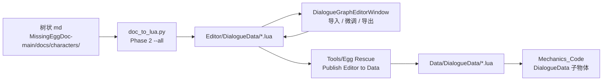

# 对话管线操作手册

> **用途**：从策划树状 md → 生成/编辑 lua → 发布到运行时 Data 的标准流程。  
> **关联**：[IMPLEMENTATION.md](./IMPLEMENTATION.md) · [DIALOGUE_INDEX.md](./DIALOGUE_INDEX.md) · [README_doc_to_lua.md](../MissingEggDoc-main/scripts/README_doc_to_lua.md)

---

## 1. 数据流总览



**两套目录，一次发布：**

| 目录 | 角色 |
|------|------|
| `Assets/Editor/DialogueData/` | 定稿 / 手工编辑源 |
| `Assets/Editor/DialogueData/FROM_DOC/` | 树状生成稿（`*_FROM_DOC.lua`） |
| `Assets/Data/DialogueData/` | 运行时 DouyinScript（含 `FROM_DOC/` 子目录） |
| `Assets/Editor/EditData/` | NPCData / GlobalVariables 编辑源 |
| `Assets/Data/GlobalData/` | 运行时 NPC / 变量配置 |

---

## 2. 日常改对话（已有 lua）

1. Unity 打开 **DialogueGraphEditorWindow**，导入 `Assets/Editor/DialogueData/{文件}.lua`
2. 在图中微调节点、选项、变量
3. **导出** 覆盖 Editor 副本
4. 菜单 **`Tools/Egg Rescue/Publish Editor to Data`**
5. （可选）**`Tools/Egg Rescue/Refresh Scene DialogueData`** 刷新 Scene 子物体 DouyinScript
6. 运行 **Mechanics_Code** 验证

> **不要**只改 Editor 而不 Publish — Scene 读的是 `Assets/Data/`。

---

## 3. 从树状 md 一键生成（Phase 2）

适用于新分支或对照验收，**不覆盖**现有生产文件（如 `dahuang_01.lua`）。

```bash
python3 MissingEggDoc-main/scripts/doc_to_lua.py \
  --input MissingEggDoc-main/docs/characters/大黄-对话脚本-树状样章.md \
  --output Assets/Editor/DialogueData/FROM_DOC/dahuang_01_FROM_DOC.lua \
  --all
```

生成后：

1. DialogueEditor **导入** `dahuang_01_FROM_DOC.lua`
2. Scene 中大黄 `DialogueTrigger` **起始 ID 设为 0**（入口 dispatcher）
3. 与现有 `dahuang_01.lua` 并排对比，图形微调（预期 &lt;5%）
4. 台词验收：

```bash
python3 MissingEggDoc-main/scripts/compare_doc_lua.py \
  --input MissingEggDoc-main/docs/characters/大黄-对话脚本-树状样章.md \
  --lua Assets/Editor/DialogueData/FROM_DOC/dahuang_01_FROM_DOC.lua
```

5. 满意后 **导出** → 决定是否合并进生产文件名（默认保持 `_FROM_DOC` 后缀）
6. Publish → Data

能力见 [README_doc_to_lua.md](../MissingEggDoc-main/scripts/README_doc_to_lua.md) 与 **[TREE_TO_LUA_SPEC.md](./TREE_TO_LUA_SPEC.md)**（md→lua 字段映射、入口判定、运行时接线规范，以大黄为准）。

---

## 4. 改变量

1. 更新策划 [`17-全局游戏状态变量`](../MissingEggDoc-main/docs/17-全局游戏状态变量.md)
2. 改 `Assets/Editor/EditData/GlobalVariables.lua`
3. 改相关对话 lua / ClueTrigger / BookController 条件
4. **Publish Editor to Data**
5. 校验：

```bash
python3 MissingEggDoc-main/scripts/validate_lua_vars.py
```

---

## 5. 改 NPC 分支 / 加载键

1. **NPCAssetManagerWindow** 或手改 `Assets/Editor/EditData/NPCData_Config.lua`
2. Publish（含 NPCData）
3. Scene 中 `DialogueTrigger.npcname` 须与 `NPCData.name` **完全一致**

### 加载键 vs 显示名

| 层级 | 字段 | 规范 |
|------|------|------|
| **加载键** | `DialogueTrigger.npcname` = `NPCData.name` | 可点击 NPC → 中文名；纯环境/偷听 → `E{nn}_{Action}` |
| **显示键** | 节点内 `NpcName` | 叙事说话人（玩家/描述/阿满/大黄…） |

示例：E03 偷听加载键为 **`E03_Eavesdrop`**，节点内仍可写 `NpcName = "豆豆"`。

---

## 6. 发布 Checklist

- [ ] 对话改动已导出到 `Assets/Editor/DialogueData/`
- [ ] NPC / 变量改动已保存到 `Assets/Editor/EditData/`
- [ ] **`DIALOGUE_DEBUG = false`**（[`NpcDialogueManager.lua`](../Assets/luaScripts/NpcDialogueManager.lua) 约 L49；打包/正式发布前必关）
- [ ] **`VAR_DEBUG_UI_ENABLED = false`**、**`KEEP_NPC_BRANCH_FOR_TEST = false`**（[`GlobalVariablesManager.lua`](../Assets/luaScripts/GlobalVariablesManager.lua)；开发测 UI/分支，发布前必关）
- [ ] 执行 **`Tools/Egg Rescue/Publish Editor to Data`**
- [ ] `validate_lua_vars.py` 通过
- [ ] （大改时）Refresh Scene DialogueData
- [ ] **Mechanics_Code** 点测相关 NPC / E 点

### 6.1 对话调试日志（World Debugger，非 Unity Console）

开发时在 **抖音虚拟资产调试器 → 调试** 标签页查看，过滤 `[Dialogue]` / `[DialogueLoad]`：

| 开关 / 文件 | 作用 |
|-------------|------|
| `DIALOGUE_DEBUG` in [`NpcDialogueManager.lua`](../Assets/luaScripts/NpcDialogueManager.lua) | `true`：Enter/Leave 节点、SetVar、分支跳转；**发布前改 `false`** |
| [`DialogueTrigger.lua`](../Assets/luaScripts/DialogueTrigger.lua) 的 `[DialogueLoad]` | 始终 `print`（不受 `DIALOGUE_DEBUG` 控制）；若发布也要静默需另改 |

依赖生成 lua 中的 `DocTag` 字段（`doc_to_lua.py` 输出）才能在日志里看到 `1-A#10` 等语义 ID。

### 6.2 运行时变量调试（Canvas 滚动面板，纯 Lua）

Play 后 [`GlobalVariablesManager.lua`](../Assets/luaScripts/GlobalVariablesManager.lua) 会在 **Canvas 右侧** 动态创建 **`VarDebugPanel`**（不在笔记本上）：

- 滚动列表列出 **全部 bool 变量**（int 变量不显示）
- **点击按钮** → 变量 `true`（按钮变绿高亮）
- **再点一次** → 变量 `false`（恢复暗色）
- 实时调用 `SetGlobalVar`，对话条件立即生效

开关：`VAR_DEBUG_UI_ENABLED = true`（开发）；**发布前改 `false`**。

**测大黄 FROM_DOC 示例**：点击 `E06_ViewNeedLadder` 高亮 → 点大黄看 1-A#10 梯子线；点击 `E05_GrainSoakGet` → 测 1-A′ 菜单。

World Debugger 过滤 `[GlobalVarDebug]` / `[GlobalVariables]`。

---

## 7. 图形插件不变量

导入/导出契约（**不可破坏**）：

- 节点格式：`DialogueConfig[<int>] = { ... }`，字段 PascalCase
- `Type` = `"Normal"` / `"Question"`
- bool 变量：`Value = true` / `false`（无引号）；导入已支持字面量回导
- `RotatePool = { 1, 2, 3 }` — 轮播变体入口（等权重随机）
- `ConditionBranches` — bool（TrueNext/FalseNext）与 int（Op/Value/Next）
- 运行时 [`NpcDialogueManager.lua`](../Assets/luaScripts/NpcDialogueManager.lua) 字段名不变

---

*最后更新：2026-06-29 · Phase 2 对话管线*
