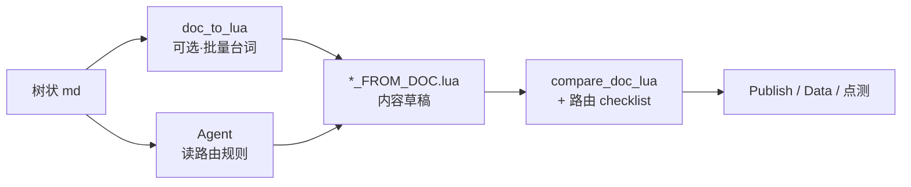

# 树状对话 md → Lua 生成规范

> **用途**：以已完成的大黄（`dahuang_01_FROM_DOC.lua`）为基准，规范「树状策划稿 → 可运行 DialogueConfig」的全流程。后续 NPC（黑猫、小鸡侦探团等）按同一套契约生成。  
> **前置阅读**：[18-树状对话脚本生成方法](../MissingEggDoc-main/docs/18-树状对话脚本生成方法.md)（怎么写 md）· [DIALOGUE_PIPELINE.md](./DIALOGUE_PIPELINE.md)（怎么发布）· [大黄-对话脚本-树状样章](../MissingEggDoc-main/docs/characters/大黄-对话脚本-树状样章.md)（准稿样章）

---

## 1. 端到端流程（混合式：工具 + Agent）

目标不是「一键生成完美 lua」，而是 **最快得到可点测 lua**。台词可脚本批量出；**路由由 Agent 读 md §路由规则后直接改 lua**（参考 [`dahuang_01_FROM_DOC.lua`](../Assets/Data/DialogueData/dahuang_01_FROM_DOC.lua) 的 `entry#*` 模板）。



| 阶段 | 产出 | 谁做 |
|------|------|------|
| 策划 | 树状 md + `17` 变量 + **§路由规则** | 策划 |
| **内容** | 对白 / hub 菜单文案 / SetVariables / RotatePool | `doc_to_lua.py --no-entry`（**可选**） |
| **路由** | `DialogueConfig[0]`、Next、hub 多回访 gate | **Agent 直接改 lua** |
| 发布 | `Data/` + Scene | Publish 菜单 |
| 接线 | NPCData、`DialogueTrigger.startID` | Inspector |

**铁律**

- `doc_to_lua.py` **不写** per-NPC entry 链（大黄 `--with-entry` 为历史债，新 NPC 不复制）。
- **禁止**为单个 NPC 扩展生成器路由逻辑（无 `--npc profile`、无新 `build_entry_node`）。
- [`apply_routing.py`](../MissingEggDoc-main/scripts/apply_routing.py) **已 deprecated**，不再维护；勿重跑覆盖手改 lua。
- 改 py 前先问：**「比直接改 20 行 lua 更省事吗？」** — 若否，改 lua。

### 1.1 何时不用 doc_to_lua（Agent 手写更快）

| 情况 | 做法 |
|------|------|
| 节点少、整文件 &lt;30 句 | Agent 从 md 直接写 lua |
| 无 `###` 标题的 inline 节（如 3-A、NGPlus 回访） | 生成器常漏 → Agent 补节点 |
| 多回访 hub（小鸡 Status 1/2/3 + 子项返回） | 内容层出一个 hub 即可；**多个 Question + gate 手改 lua** |
| parser 对同一 md 已两次失手 | 停止扩 py，改 lua |

### 1.2 路由 SOP（Agent，不先改 py）

1. 读 md：流程总览、入口判定、自检表、**§路由规则**（模板见 [`淑芬-对话脚本-树状.md`](../MissingEggDoc-main/docs/characters/淑芬-对话脚本-树状.md)）。
2. 内容草稿：`doc_to_lua --no-entry` 或手写。
3. 路由：抄大黄 `entry#0` / gate 链；改 intro→hub、子项 bypass intro；复杂 hub **复制完整 Options 块**到各回访 Question。
4. 验收：`compare_doc_lua` 台词 missing=0（分文件）；路由 checklist；Unity 无语法错误。
5. 登记：doc 17 新变量、NPCData → `*_FROM_DOC`。

**运行时读** `Assets/Data/DialogueData/`；改 md 后：生成/手改 → Publish → Refresh Scene。

---

## 2. 文件命名与 NPC 配置

### 2.1 Lua 文件

| 类型 | 命名 | 示例 |
|------|------|------|
| 生成稿（不覆盖旧生产） | `FROM_DOC/{npc}_{branchId}_FROM_DOC.lua` | `FROM_DOC/dahuang_01_FROM_DOC.lua` |
| 定稿合并后（可选） | `{npc}_{branchId}.lua` | `heimao_01.lua` |

- `branchId` 与 `NPCData_Config.lua` 的 `storyGraphs[].branchId` 一一对应。
- 大黄当前：**仅 branch 1** 指向 `dahuang_01_FROM_DOC`；勿在对话节点里写 `UnlockBranches` 指向不存在的 branch（曾导致 `NPC 大黄 2 Lua` 报错）。

### 2.2 NPCData_Config.lua

```lua
{
    name = "大黄",                    -- 必须与 DialogueTrigger.npcname 完全一致
    currentBranchId = 1,
    storyGraphs = {
        {
            branchId = 1,
            luaModuleName = "dahuang_01_FROM_DOC",
            luaAssetPath = "Assets/Editor/DialogueData/FROM_DOC/dahuang_01_FROM_DOC.lua"
        }
    }
}
```

Scene 中 `DialogueData` 子物体名 = `luaModuleName`（无扩展名）。

### 2.3 Scene 交互物体

| 组件 | 字段 | 大黄样例 |
|------|------|----------|
| `DialogueTrigger` | `npcname` | `大黄` |
| `DialogueTrigger` | `ID` | **0**（入口 dispatcher，不是 1-A 的语义 ID） |
| `DouyinInteractor` | `ButtonConfigs[0].Text` | `大黄对话`（交互键文案，与对话内容无关） |
| 专属控制器 | — | `DaHuang.lua`：模型 + 交互点切换 |

---

## 3. 树状 md 写作要求（生成器可读子集）

完整写法见 [18 §18.2](../MissingEggDoc-main/docs/18-树状对话脚本生成方法.md)。以下为 **doc_to_lua.py 硬依赖**：

### 3.1 文档结构

1. 顶部 **流程总览**（入口优先级、hub 路径、对话结束口径）
2. 每章开头 **〔系统注〕入口判定**（按序匹配第一条）
3. 每节点 `### {ID} · {标题}` + 系统注 + ` ```text ` 树块
4. 文末 **条件覆盖自检表**

### 3.2 text 树块标签 → 生成行为

| md 标签 / 行格式 | 生成结果 |
|------------------|----------|
| `玩家：…` / `大黄：…` / `{NPC}：…` | `Type=Normal`，`NpcName` = 说话人 |
| `描述：（……）` | `NpcName = "描述"`，`Dialogue = "（……）"` |
| 连续对白行 | 拆成链式多个 Normal 节点，`Next` 递增 |
| `【回访】` + 台词 | hub 的 `Question.Dialogue`（同屏菜单前的 NPC 短句） |
| `【菜单】` + `「选项」（条件）→ 目标` | `Type=Question`，`Options[]` |
| `【条件】（expr）` + 对白 | 节点末或独立链上的 `ConditionBranches`（bool TrueNext/FalseNext） |
| `【轮播】` + 多个变体块 | 父节点 `RotatePool = { id1, id2, … }` |
| `→ 对话结束` | `Next = -1` |
| `→ 1-D【回访】+【菜单】` | 子链末节点 `Next` = hub 的 Question 节点 ID |
| `→ 1-D（DogStatus==3）` / 多出口 | 末节点 `ConditionBranches`（int `Op`/`Value`/`Next`） |
| `【变量】` + `· Var = value` | 该段**最后一个** Normal 节点的 `SetVariables` |
| `→ 黑猫 2-A` | `UnlockBranches` + `cross_npc_map.json` 映射 |
| 无对白、仅入口路由 | `Dialogue=""` 的 dispatcher 节点（见 §4） |

### 3.3 菜单项条件表达式

```text
「梯子能借我吗？」（E06_ViewNeedLadder && !E06_LadderBorrowed）→ 1-E
```

生成：

```lua
{
    Text = "梯子能借我吗？",
    Next = <1-E 首节点 id>,
    DisplayConditions = {
        { VarName = "E06_ViewNeedLadder", VarType = "bool", Value = true },
        -- 多条件 AND；!Var 生成 Value = false 或反向比较
    }
}
```

- 条件不满足 → **不生成选项**（不是灰显）。
- 选项 `Text` 是菜单缩略语；完整玩家句写在目标子节点首句。

### 3.4 描述行

- md：`描述：（大黄扭头看向木梯）`
- lua：`Dialogue = "（大黄扭头看向木梯）"`（保留括号）
- 禁止括号内以「玩家」作主语/宾语

### 3.5 不生成 / 人工处理的节点

| 情况 | 处理 |
|------|------|
| **2-D** 等「由对方脚本触发」 | md 保留系统注；生成器跳过；在黑猫脚本里 `StartDialogueWithData` |
| 环境交互（E06 架梯、线索大图） | 写在 `miaosu.lua` 或 `E06LadderController.lua`，不进 NPC 树 |
| 双交互点（谷仓 / 红顶） | md 只写入口判定；Scene + `DaHuang.lua` 管显隐 |

---

## 4. 入口判定（DialogueConfig[0]）

**淑芬 / 小鸡 / 新 NPC**：Agent 读 md **§路由规则**，**直接在 lua 里**插入 `DialogueConfig[0]` 与 gate 链；`DialogueTrigger.ID=0`（E03 偷听等独立模块可 `startID=1`，无 entry）。

**大黄**（历史）：`doc_to_lua.py --with-entry` 内建 `build_entry_node()`；新 NPC **不复制**。

> `apply_routing.py` 已 deprecated；曾用于试验自动接路由，易出错（如 hub Options 截断），**以手改 lua 为准**。

### 4.1 结构

```
DialogueConfig[0]          -- 总入口：NGPlus 等全局优先
    └─ ConditionBranches / Next
DialogueConfig[121..118]   -- entry#barn1..entry#ds4 谷仓链
DialogueConfig[117..108]   -- entry#rr1..entry#rr5 红顶链
```

- `DialogueTrigger.ID = 0` → 永远从 `DialogueConfig[0]` 进。
- 每个 entry 节点：`NpcName="描述"`, `Dialogue=""`, 仅 `ConditionBranches` + `Next` fallback。
- **按 md 系统注顺序**：生成器把「第一条匹配」放在 ConditionBranches 靠前/int 链前端。

### 4.2 大黄入口对照

**谷仓**（`DogStatus < 4`，Scene 物体「大黄」）

| 优先级 | 条件 | 目标语义 ID |
|--------|------|-------------|
| 1 | `DogStatus == 1` | 1-A |
| 2 | `DogStatus == 2` | 1-A′ |
| 3 | `DogStatus == 3` | 1-D |

**红顶**（`DogStatus == 4`，Scene 物体「大黄 2」）

| 优先级 | 条件 | 目标 |
|--------|------|------|
| 1 | `NGPlus` | NGPlus 轮播 |
| 2 | `!RedRoof_IntroShown` | 2-A |
| 3 | `!Dog_BlackCatSummoned` && … | 2-hub / 催查 E13 |
| … | （见 md 红顶系统注） | … |

新 NPC 照抄：**一章一条 entry 链**，每链末尾 `-1` 表示无可进节点。

---

## 5. Lua 节点字段契约

与 `DialogueGraphEditorWindow` 导入/导出一致（不可改字段名）：

```lua
DialogueConfig[n] = {
    Type = "Normal" | "Question",
    DocTag = "1-A#3",              -- 语义 ID，调试日志用
    NpcName = "大黄" | "玩家" | "描述",
    NpcSprite = "守望" | "疑惑" | "",  -- TouXiang_LiHui PNG 文件名（无扩展名）；描述/大树留 ""；玩家见 §5.1.1
    Dialogue = "...",
    Next = <int | -1>,

    -- 可选
    Options = { { Text, Next, DisplayConditions?, ConditionBranches?, BranchFlag? } },
    SetVariables = { { VarName, VarType, Value } },
    ConditionBranches = {
        -- bool
        { VarName, VarType = "bool", TrueNext, FalseNext },
        -- int
        { VarName, VarType = "int", Op = "==", Value, Next },
    },
    RotatePool = { 74, 78, 82 },
    UnlockBranches = { { NpcName = "黑猫", BranchId = 1 } },
}
```

### 5.1 DocTag 命名

| 模式 | 含义 |
|------|------|
| `1-A#3` | 节点 1-A 第 3 句 |
| `1-A'` | hub Question |
| `1-A@cond#1` | 1-A 内【条件】分支 |
| `2-C@v2#1` | 2-C 轮播变体 2 第 1 句 |
| `entry#barn2` | 入口 dispatcher |
| `NGPlus` | 轮播池入口 |

### 5.1.1 NpcSprite 立绘 key（`TouXiang_LiHui` 文件名）

| 角色 | 中立 | 特殊 |
|------|------|------|
| 淑芬 | `守望` | `护雏` |
| 大黄 | `醉倒` | `执勤`、`振奋` |
| 悲伤蛙 | `丧` | `介入` |
| 鼠哥/鼠弟 | `兜售` | `八卦`、`发怵` |
| 小鸡（阿满等） | `装酷` | `心虚`、`愧疚`、`背对`（仅 E03 偷听） |
| 乌鸦 | `得意` | `吝啬`、`叫嚣` |
| 黑猫 | `高傲` | `审视`、`炸毛` |
| 大树 | `""` | — |
| 闪电蜗牛 | `待机` | `闪电蜗牛` |
| **玩家** | `正常`（默认） | `疑惑`、`惊讶` |

树状 md 写 `角色·立绘名：台词`；`doc_to_lua` 导出为 `NpcSprite`。NPC 空则回退 `NPCData.avatarPath`。

#### 玩家表情选用（`Assets/Res/Model/TouXiang_LiHui/Player/`）

| key | 运行时表现 | 含义 |
|-----|------------|------|
| `正常` | UI 上的固定立绘，无符号 | **默认**；陈述、答应、汇报、短附和 |
| `疑惑` | 同一立绘 + `playerQuestion` | **求信息的提问** |
| `惊讶` | 同一立绘 + `playerExclamation` | **震惊 / 不可思议 / 情绪爆发** |

运行时**不改**玩家 `Image.sprite`（沿用场景/UI 上已放好的立绘）；`疑惑`/`惊讶` 只开关 Inspector 绑定的 `playerExclamation` / `playerQuestion`。

`NpcName = "玩家"` 时 `NpcSprite` 填上表之一；空字符串运行时视为 `正常`。

**疑惑**：对 NPC / 线索主动打听、求证、追问（以获取信息为目的），典型以 `？`/`?` 收尾，语气是调查而非被吓到。例：「你看到过什么吗？」「那是你的午睡点吗？」「有鸡来过池塘边？」

**惊讶**：被内容打脸 / 吓到 / 不可思议，或短促反应、带 `！` / `？！` / `竟然` 的爆发。例：「什么？」「你就是那棵大树！！」「白石头？！」「我竟然不知道乌鸦是长毛的？」

**正常**：其余全部——答应、陈述、汇报线索、短附和、无问号独白等。例：「好，我来帮你找找。」「淑芬，那只乌鸦叼的原来是石头。」

**冲突优先级**（同一句又像提问又像震惊）：

1. 含 `！` / `？！` / `竟然` / 连续 `？？` → **惊讶**
2. 极短反应（约 ≤4 字，如「什么？」「新案子？」「乌鸦？」）→ **惊讶**
3. 其余以 `？` 收尾的打听 → **疑惑**
4. 否则 → **正常**

选项回显（无节点 `NpcSprite`）运行时对 `option.Text` 套用同一优先级。

文件头注释保留 **语义 ID → 整数 ID** 映射，便于对照 md。

### 5.2 hub（Question）固定形态

```lua
DialogueConfig[14] = {
    Type = "Question",
    DocTag = "1-A'",
    NpcName = "大黄",
    Dialogue = "嗝……",        -- 【回访】台词
    Options = { ... }          -- 【菜单】
    -- Question 无 Next；选项 Next 指向子节点首句
}
```

hub **必须**【回访】+【菜单】同屏（md 与 lua 一致）。

**菜单显示上限（运行时）**：条件过滤后若可显示选项 **> 4**，UI 只保留 **前 3 项 + 最后一项**。最后一项约定为告辞/结束对话（`Next = -1`），策划写菜单时须把告辞排在【菜单】块末尾；其余话题下次再点 hub 会出现。

### 5.3 子项返 hub / 跨章返链

**同章返 hub**（1-E → 1-D）：

```lua
-- 1-E 末节点
Next = 29   -- 1-D Question 的 ID
```

**跨章返链**（1-F 按 DogStatus 回 1-D 或 2-hub）：

```lua
ConditionBranches = {
    { VarName = "DogStatus", VarType = "int", Op = "==", Value = 3, Next = 29 },
    { VarName = "DogStatus", VarType = "int", Op = "==", Value = 4, Next = 62 },
}
Next = -1
```

md 出口写多条 `→ hub（DogStatus==3）` 时，生成器合并到末节点 `ConditionBranches`。

---

## 6. 运行时行为（与 lua 配合）

### 6.1 NpcDialogueManager 选项规则

选中菜单项后：

| 下一段首句 | 行为 |
|------------|------|
| **玩家**先说话 | 不播选项缩略语，直接跳进子节点 |
| 选项与下一句**完全相同** | 再跳一段（防重复，如 1-A′→1-C） |
| **NPC / 描述**先说话 | 先播选项文字，点 Next 再跳转 |

**hub 菜单显示上限**：`DisplayConditions` 过滤后若可显示项 **> 4**，只展示 **前 3 + 最后一项**（末项须为告辞，`Next = -1`，写在菜单末尾）。

选项是缩略语；完整句写在子节点。生成 hub 时保证子节点首句与选项 Text 的关系符合上表。

### 6.2 空 dispatcher 自动跳过

`Dialogue=""` 的 entry / 路由节点：`UpdateDialogueUI` 自动沿 `ConditionBranches` / `Next` 向下，直到有台词的节点。

### 6.3 变量写入时机

`SetVariables` 在**该节点台词播完、离开节点前**执行（`ApplySetVariables`）。md 【变量】块写在节点末，与「播完再写入再跳转」一致。

### 6.4 跨 NPC（UnlockBranches）

md：`→ 黑猫 2-A`（2-B 末）

lua：

```lua
UnlockBranches = { { NpcName = "黑猫", BranchId = 1 } },
ChainDialogue = { NpcName = "黑猫", StartId = 1 },  -- 同链转接 2-A，EndDialogue 后自动 StartNpcDialogue
Next = -1
```

`cross_npc_map.json` 登记 doc 节点 → 目标 NPC branch；**禁止** Unlock 到未在 NPCData 配置的 branch。强制播（不按键）用 `DialogueAreaTrigger.lua`；同链转接用 `ChainDialogue`。

### 6.5 专属场景脚本（何时需要）

对话 lua **只管台词与变量**；以下内容用独立 Lua：

| 职责 | 大黄实现 | 新 NPC 何时需要 |
|------|----------|-----------------|
| 模型/替身显隐 | `DaHuang.lua` + `DogStatus` | 阶段切换要换模型 |
| 多交互点切换 | 谷仓「大黄」/ 红顶「大黄 2」 | 同 NPC 多地点 |
| 交互键开关 | `DisableInteraction()` + Collider | 离场后不可再点 |
| 环境联动 | `E06LadderController.lua` | 对话写入 bool 后还要改场景物体 |

关闭交互点**必须**调用 `DouyinInteractor.DisableInteraction()`，不能只关 Collider。

---

## 7. 生成命令与验收

### 7.1 生成

```bash
python3 MissingEggDoc-main/scripts/doc_to_lua.py \
  --input MissingEggDoc-main/docs/characters/{角色}-对话脚本-树状.md \
  --output Assets/Editor/DialogueData/FROM_DOC/{npc}_{branch}_FROM_DOC.lua \
  --all
```

新 NPC 需扩展 `doc_to_lua.py` 中：

- `SPEAKER_LINE` 正则（说话人名单）
- `DEFAULT_ALL_SECTIONS` 或 `--sections` 节点列表
- `cross_npc_map.json`（若有跨 NPC）
- 入口判定生成逻辑（若与大黄章节结构不同）

### 7.2 台词对照

```bash
python3 MissingEggDoc-main/scripts/compare_doc_lua.py \
  --input MissingEggDoc-main/docs/characters/{角色}-对话脚本-树状.md \
  --lua Assets/Editor/DialogueData/FROM_DOC/{npc}_{branch}_FROM_DOC.lua
```

目标：**missing = 0**。

### 7.3 变量校验

```bash
python3 MissingEggDoc-main/scripts/validate_lua_vars.py
```

脚本内 `VarName` 必须 ⊆ `GlobalVariables.lua`。

### 7.4 Unity 点测清单

- [ ] DialogueEditor 导入无报错；导出再导入字段不丢
- [ ] Publish → Data；Refresh Scene DialogueData
- [ ] `DialogueTrigger.ID = 0`；`npcname` 与 NPCData 一致
- [ ] 首访 / hub / 菜单隐藏项 / 返 hub / 对话结束
- [ ] 入口判定每条（改 Debug 面板 bool/int 复测）
- [ ] 跨 NPC Unlock（若适用）
- [ ] 离场后交互键不残留
- [ ] 发布前关 `DIALOGUE_DEBUG`、`VAR_DEBUG_UI_ENABLED`、`KEEP_NPC_BRANCH_FOR_TEST`

---

## 8. 人工收尾（约 5%）

| 项 | 说明 |
|----|------|
| Scene 接线 | DialogueTrigger、DouyinInteractor 按钮文案、碰撞体范围 |
| **强制播 Trigger** | `DialogueAreaTrigger.lua` + 大 `BoxCollider(isTrigger)`；大树见 `InteractionPoint/TreeDialogue/TreeForceZone` |
| **大树点击阶段** | `TreeClickZone`：`DialogueTrigger ID=0` + `TreeInteractionController` 在 `TreeHardShown&&!Summoned` 时启用 |
| NPCData | branch 指向 `_FROM_DOC` 或定稿文件名 |
| 双交互点 / 模型 | 写 `{Npc}Controller.lua`，按 Status 切换（如 `DaHuang.lua`、`BlackCatInteractionController.lua`） |
| 环境 E 点 | miaosu 描述段 + 专用 Controller |
| 跨脚本触发 / 同链 | `ChainDialogue = { NpcName, StartId }` 或 `StartNpcDialogue`；2-D 类节点在对方 NPC 脚本触发 |
| 图形微调 | 连边错误、Position 重叠时在 DialogueEditor 改后导出 |

---

## 9. 新 NPC 启动模板

### 9.1 策划侧

1. 复制 [18 §18.5 骨架](../MissingEggDoc-main/docs/18-树状对话脚本生成方法.md#185-新建文件骨架) → `characters/{角色}-对话脚本-树状.md`
2. 在 `17` 登记变量 + §速查表
3. 对照大黄样章写：流程总览 → 入口判定 → 节点 → 自检表

### 9.2 程序侧

1. `doc_to_lua.py` 加说话人 / section 列表
2. 生成 `{npc}_01_FROM_DOC.lua`
3. `compare_doc_lua.py` + DialogueEditor 导入
4. `NPCData_Config.lua` 增加 branch
5. Scene 放交互物体 + `DialogueTrigger`
6. 按需写 `{Npc}.lua` 控制器
7. Publish + 点测

### 9.3 推荐顺序（与 18 §18.6 一致）

大黄（已完成）→ 黑猫 → 小鸡侦探团 → 淑芬 / 蛙 / 老鼠 → 乌鸦 / Flash

---

## 10. 大黄样章速查（已实现对照）

| md 概念 | lua 实现 |
|---------|----------|
| 1-A 首访链 | `DialogueConfig[1..10]` + 条件梯段子链 `[11..13]` |
| 1-A′ hub | `DialogueConfig[14]` Question |
| 1-D / 2-hub | `[29]` / `[62]` Question |
| 1-G 离场 | 末节点 `DogStatus=4`, `Next=-1` + `DaHuang.lua` 关谷仓点 |
| 2-B → 黑猫 | `[73]` UnlockBranches + `Dog_BlackCatSummoned` |
| 2-C 轮播 | `[92]` RotatePool |
| NGPlus | `[0]` → `[107]` RotatePool |
| 入口 | `[0]` + `[121..108]` entry 链 |

---

*关联：[README_doc_to_lua.md](../MissingEggDoc-main/scripts/README_doc_to_lua.md) · [DIALOGUE_INDEX.md](./DIALOGUE_INDEX.md) · [IMPLEMENTATION.md](./IMPLEMENTATION.md)*

*最后更新：2026-06-29 · 基准：大黄 dahuang_01_FROM_DOC 全量实装*
